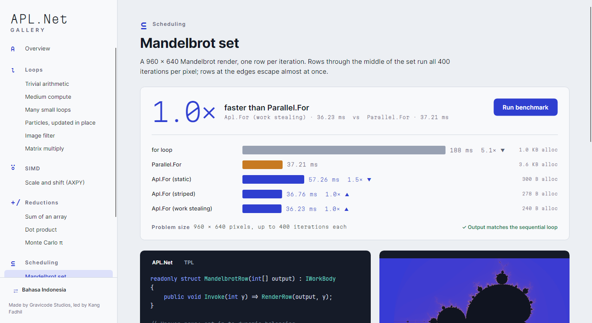
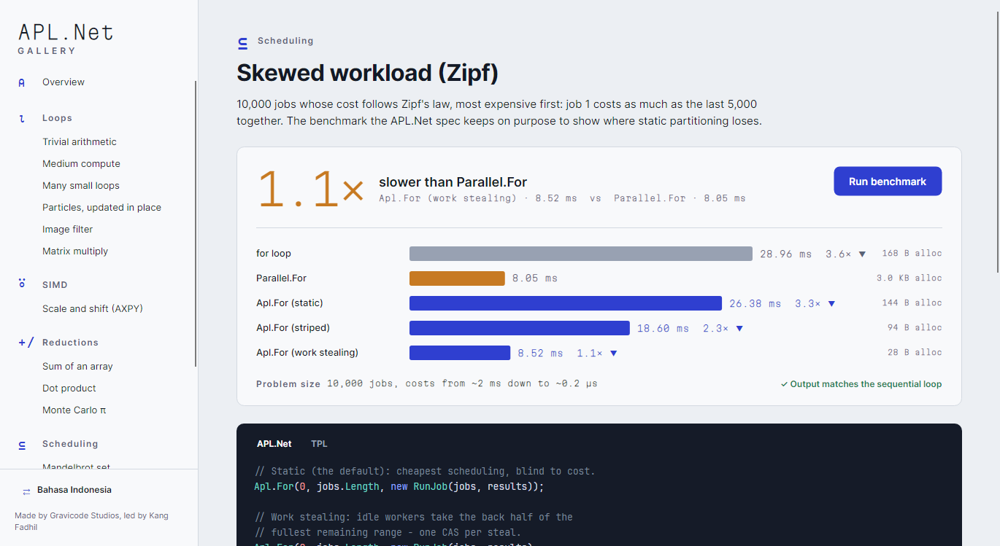

# APL.Net — Another Parallel Library for .NET

**Parallel loops without the per-iteration tax.** APL.Net gives .NET data-parallel loops the JIT
compiles for your exact body, with no delegate call, no `Task`, no captured `ExecutionContext` and
no allocation per call, plus explicit SIMD kernels, an opt-in pointer tier and a source generator.
It uses no native interop and is NativeAOT-safe.

**Loop paralel tanpa pajak per iterasi.** APL.Net menyediakan loop paralel-data untuk .NET yang
di-compile JIT khusus untuk body Anda: tanpa pemanggilan delegate, tanpa `Task`, tanpa
`ExecutionContext` yang ditangkap, dan tanpa alokasi per panggilan. Ditambah kernel SIMD
eksplisit, tingkat pointer yang opt-in, dan source generator. Tanpa interop native, dan aman untuk
NativeAOT.

> Made by **Gravicode Studios**, led by **Kang Fadhil**. · Dibuat oleh **Gravicode Studios**,
> dipimpin oleh **Kang Fadhil**.


## Install / Instalasi

```sh
dotnet add package APL.Net
```

Requires .NET 10. The source generator is included. · Butuh .NET 10; source generator sudah
termasuk.

## Quick start / Mulai cepat

```csharp
using AplNet;
using AplNet.Core;
using AplNet.Simd;

// TPL
Parallel.For(0, n, i => result[i] = Compute(data[i]));

// APL.Net: same shape, less overhead / bentuk sama, overhead lebih kecil
Apl.For(0, n, i => result[i] = Compute(data[i]));

// Zero-allocation struct body, inlined by the JIT / struct body tanpa alokasi, di-inline JIT
readonly struct ComputeBody(double[] data, double[] result) : IWorkBody
{
    public void Invoke(int i) => result[i] = Compute(data[i]);
}
Apl.For(0, n, new ComputeBody(data, result));

// Or let the generator write it / atau biarkan generator menulisnya
[AplBody] internal static void Step(int i, double[] data, double[] result) => result[i] = Compute(data[i]);
Apl.For(0, n, AplGen.Step(data, result));

// SIMD, parallel / SIMD, paralel
double total = SimdOps.ParallelSum(values);
SimdOps.ParallelTransformInPlace(samples, new MultiplyAddOperator<float>(gain, offset));

// Uneven work: opt in to balancing / beban timpang: pilih penyeimbangan
Apl.For(0, rows, new RenderRow(image), new AplOptions { Partitioner = new WorkStealingPartitioner(1) });
```

> ⚠️ **Behaviour difference from TPL / Perbedaan perilaku dari TPL:** the `ExecutionContext` does
> **not** flow to pool workers, so `AsyncLocal<T>` values and ambient culture are not visible inside
> bodies running on other threads. Pass state explicitly. · `ExecutionContext` **tidak** mengalir ke
> worker pool; nilai `AsyncLocal<T>` dan culture tidak terlihat di body yang berjalan di thread
> lain. Teruskan state secara eksplisit.

## What's inside / Isinya

| Layer / Lapisan | API |
|---|---|
| Ergonomic / Ergonomis | `Apl.For`, `Apl.ForRange`, `Apl.ForEach`, `Apl.Reduce`, `Apl.ForEachAsync` |
| Struct invoker | `IWorkBody`, `IRangeWorkBody`, `IWorkBody<T>`, `IReduceBody<T>` |
| Scheduling / Penjadwalan | `StaticRangePartitioner` (default), `StripedPartitioner`, `WorkStealingPartitioner` |
| SIMD | `SimdOps` over Vector512/256/128 with scalar fallback; operator structs |
| Unsafe | `UnsafeParallel` (function pointers), `NativeBuffer<T>` |
| Tooling | `[AplBody]` source generator, `AplNet` EventSource counters |

## Benchmarks

Intel i7-8650U (4C/8T, laptop), .NET 10.0.12, BenchmarkDotNet 0.15.8. Lower is better; ratios
are against `Parallel.For`. · Lebih kecil lebih baik; rasio dibandingkan `Parallel.For`.

| Benchmark | `Parallel.For` | Best APL.Net | Ratio |
|---|---:|---:|---:|
| B7 call overhead, 1K elements (struct body) | 10.35 µs, ~2.9 KB alloc | **2.79 µs, 0 B** | **3.7×** |
| B1 `x*2+1`, 10K doubles (in cache) | 25.44 µs | **5.81 µs** (`ForRange`) | **4.4×** |
| B1 `x*2+1`, 1M doubles (memory-bound) | 1,383 µs | 1,176 µs (lambda) – 1,406 µs (struct) | ~1.0× |
| B2 `√x·sin x`, 1M | 3,986 µs | **3,166 µs** | **1.26×** |
| B4 AXPY, 1M floats | 1,138 µs | **60 µs** (`SimdOps.ParallelTransformInPlace`) | **19×** |
| B5 sum, 1M doubles | 1,103 µs | **194 µs** (`SimdOps.ParallelSum`) | **5.7×** |
| B6 Zipf, heavy first | 12.9 ms | **8.9 ms** (work stealing) | **1.44×** |
| B6 Zipf, shuffled | **10.1 ms** | 13.2 ms (static) | **0.77× — TPL wins** |

**Honest reading / Cara membaca yang jujur:** on trivial work over arrays larger than cache, every
variant (sequential included) is memory-bound, and APL.Net ≈ TPL. On skewed work, TPL's dynamic
chunking can win; opt in to `WorkStealingPartitioner`, or keep TPL. · Pada kerja ringan atas array
yang lebih besar dari cache, semua varian terikat memori (APL.Net ≈ TPL). Pada beban timpang, TPL
bisa menang.

Full tables, the environment, and how to read them / Tabel lengkap, lingkungan, dan cara
membacanya: [docs/en/benchmark-results.md](docs/en/benchmark-results.md) ·
[docs/id/benchmark-results.md](docs/id/benchmark-results.md).

## When *not* to use it / Kapan *tidak* memakainya

- **Small `n`.** Waking even one thread costs microseconds. · **`n` kecil**: membangunkan satu
  thread saja butuh beberapa mikrodetik.
- **Uneven work with the default partitioner.** Static splitting loses to `Parallel.For`; use
  `WorkStealingPartitioner` or TPL. · **Beban timpang dengan partitioner default**: pembagian
  statis kalah dari `Parallel.For`.
- **I/O-bound bodies.** Dispatch cost is irrelevant, so use `Parallel.ForEachAsync`. · **Body yang
  terikat I/O**: biaya dispatch tidak relevan.
- **Bodies that rely on `AsyncLocal`/culture flowing from the caller.** · **Body yang bergantung
  pada aliran `AsyncLocal`/culture dari pemanggil.**
- **Trivial work over arrays far larger than cache.** Memory bandwidth is the limit, for every
  library. · **Kerja ringan atas array jauh melebihi cache**: batasnya bandwidth memori.

## APL.Net Gallery

An Avalonia desktop app with 14 cases. Each one runs APL.Net against TPL on your machine and shows
the code, the timings, a check against the sequential output, and (for scheduling) a per-thread
lane chart. It is bilingual (EN/ID). · Aplikasi desktop Avalonia berisi 14 kasus yang
membandingkan APL.Net dan TPL di mesin Anda, lengkap dengan kode, waktu, pengecekan hasil, dan lane
chart per thread. Tersedia dalam dua bahasa.

```sh
dotnet run --project samples/APL.Net.Gallery -c Release
```

| | |
|---|---|
|  |  |
|  |  |
|  |  |


## Documentation / Dokumentasi

- English: [docs/en/README.md](docs/en/README.md)
- Bahasa Indonesia: [docs/id/README.md](docs/id/README.md)
- Design decisions / Keputusan desain: [en](docs/en/design-decisions.md) · [id](docs/id/design-decisions.md)
- Roadmap: [PLAN.md](PLAN.md) · Status: [Progress.md](Progress.md) · [CONTRIBUTING.md](CONTRIBUTING.md)

## Build from source / Build dari source

```sh
dotnet build APL.Net.slnx -c Release
dotnet test --project tests/APL.Net.Tests -c Release
dotnet run -c Release --project benchmarks/APL.Net.Benchmarks -- --filter '*'
```

## License / Lisensi

MIT © 2026 Gravicode Studios (led by Kang Fadhil). Gallery fonts: Martian Mono and JetBrains
Mono (SIL OFL 1.1), APL385 Unicode (public domain).
