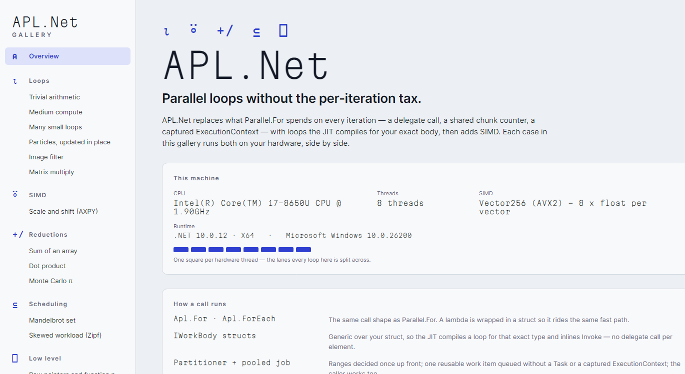
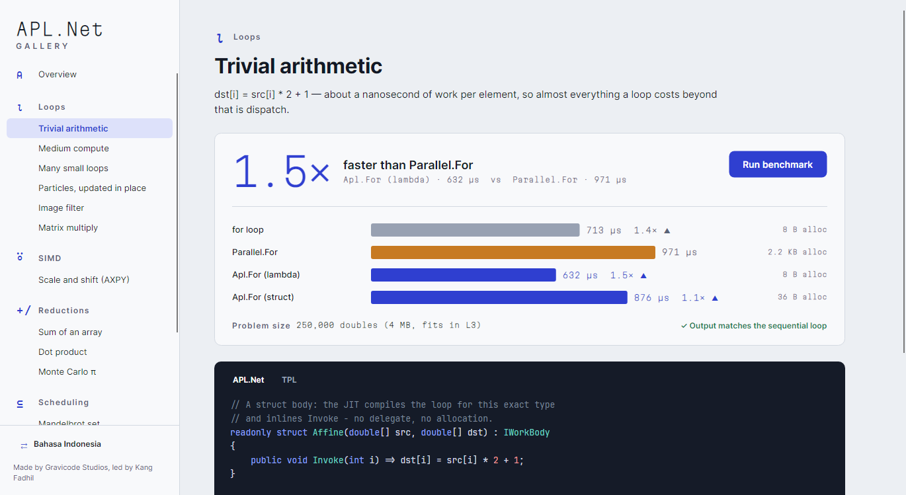
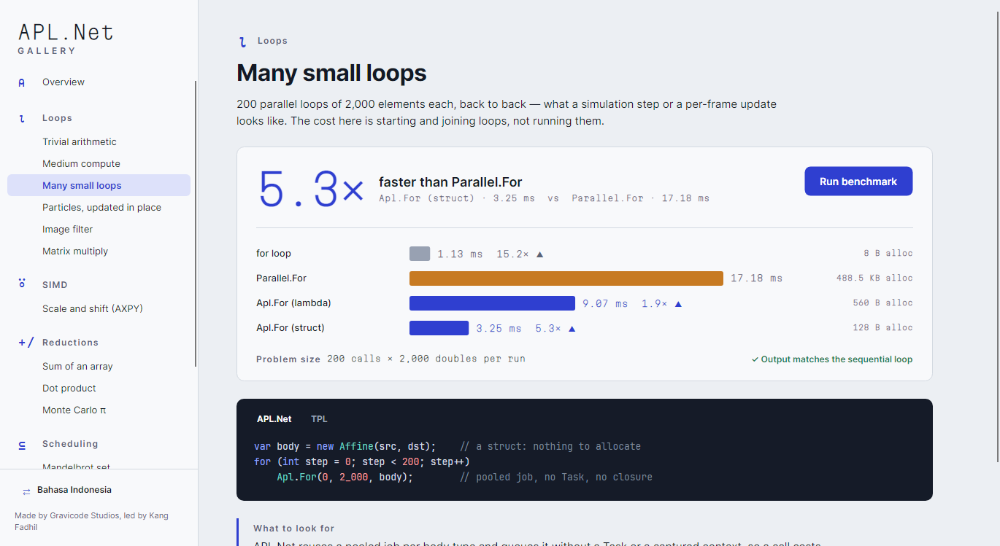
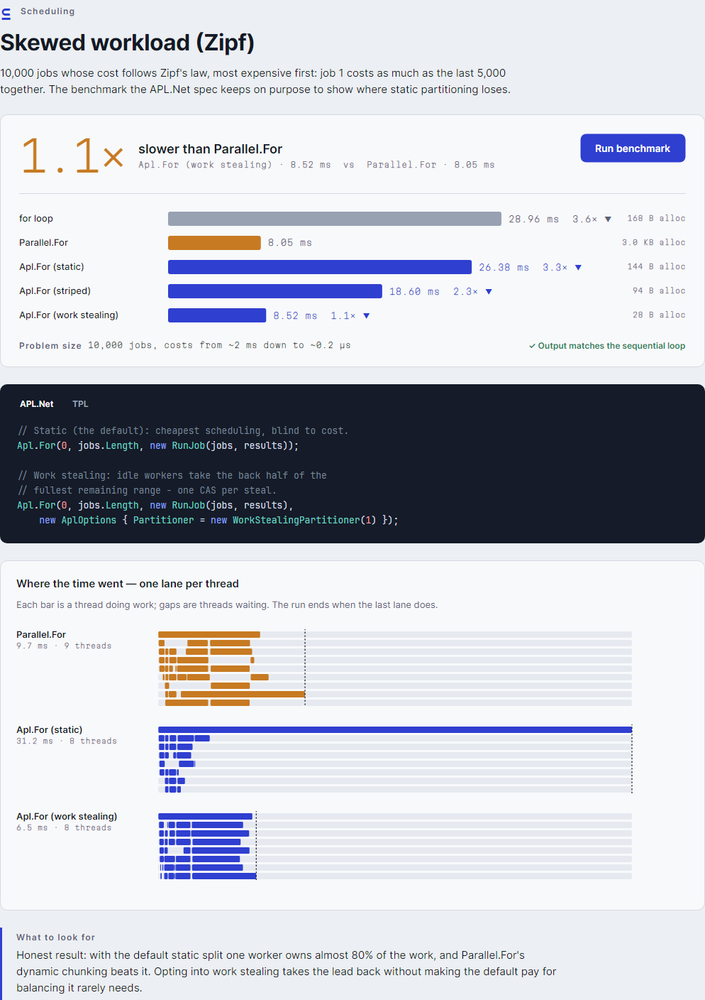
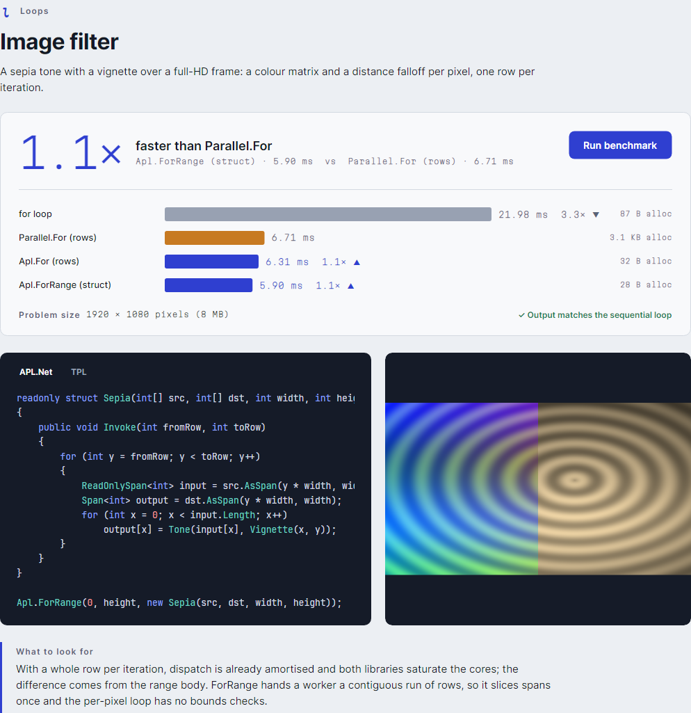
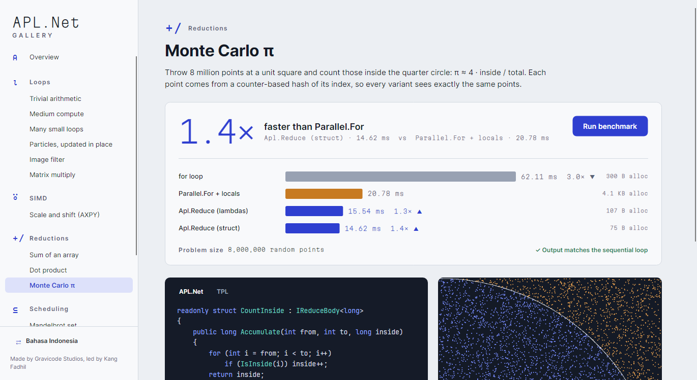
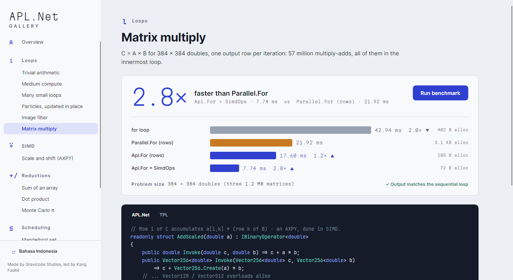
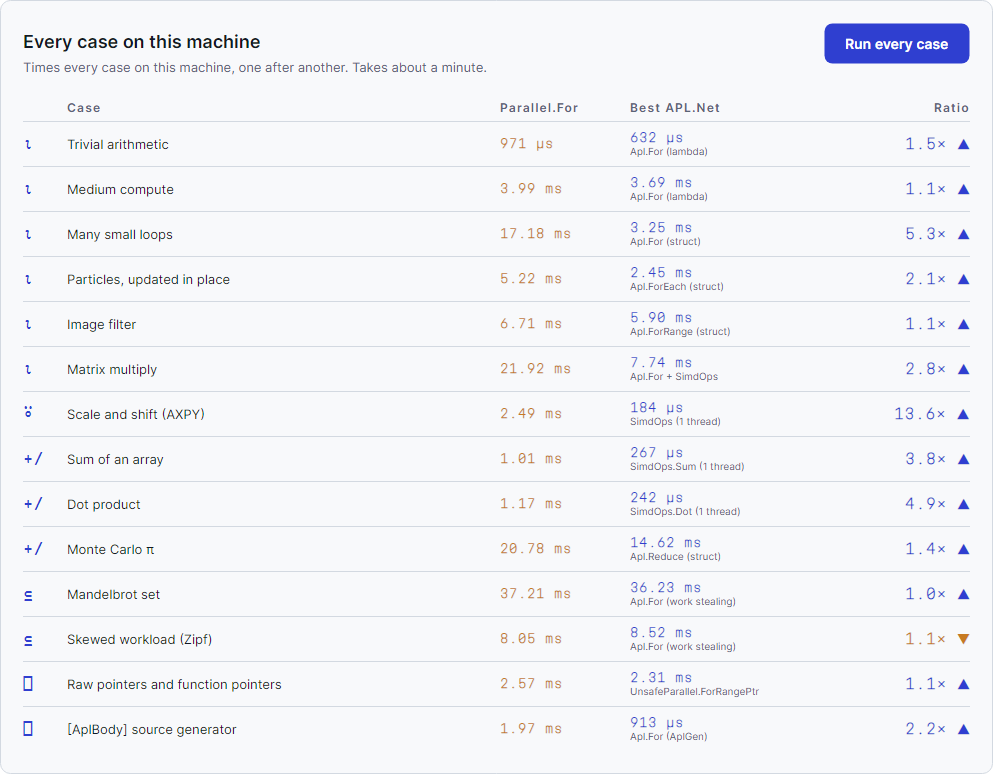
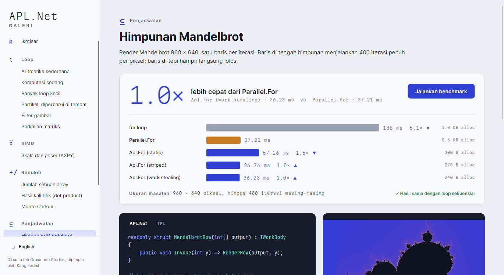

# APL.Net Gallery

[Bahasa Indonesia](../id/gallery.md) · [Index](README.md)

`samples/APL.Net.Gallery` is an Avalonia desktop app (Windows, Linux, macOS). It runs APL.Net and
TPL side by side **on your hardware**. Each case shows:

- a readout: how much faster (or slower) the best APL.Net variant was than `Parallel.For`;
- one bar per variant (sequential in slate, TPL in amber, APL.Net in ultramarine), with its median
  time, its ratio to TPL, and the bytes it allocated per run;
- a check that the APL.Net output equals the sequential loop's output;
- the APL.Net and TPL code for the case;
- a picture of the result where one exists (image filter, Monte Carlo, Mandelbrot);
- for the scheduling cases, a **lane chart**: one lane per thread, showing where each thread was
  busy and when it went idle;
- what to look for, stated plainly, including where TPL wins.

```sh
dotnet run --project samples/APL.Net.Gallery -c Release
dotnet run --project samples/APL.Net.Gallery -c Release -- --case mandelbrot --lang id
```



## The cases

The sidebar groups the cases under the APL glyph for their idea. Hover over a glyph to see what
it means.

| Glyph | Group | Cases |
|---|---|---|
| `⍳` iota | Loops | Trivial arithmetic · Medium compute · Many small loops · Particles (ForEach by ref) · Image filter · Matrix multiply |
| `⍤` rank | SIMD | Scale and shift (AXPY) |
| `+/` reduce | Reductions | Sum · Dot product · Monte Carlo π |
| `⊆` partition | Scheduling | Mandelbrot set · Skewed workload (Zipf) |
| `⎕` quad | Low level | Raw pointers and function pointers · `[AplBody]` source generator |


















## How it measures

Each variant is warmed up until tiered compilation has settled, which takes at least 3 runs. It is
then timed for about 0.5 s (5 to 200 runs), and the **median** is reported. There is a pause
between variants, so the render thread is not competing for cores while the next variant is
timed. Allocations are counted in a separate, quiet pass.

The in-app harness is fast and honest, but it is not BenchmarkDotNet. A desktop has other
processes on it. Loops that split the work statically across every core are the most affected by
this, because one busy core delays the whole loop. The figures to quote are in
[benchmark results](benchmark-results.md).

## Screenshots

Every image in the docs comes from the app itself:

```sh
dotnet run --project samples/APL.Net.Gallery -c Release -- --screenshot docs/images
```

This mode opens each case, presses *Run benchmark*, waits for the bars and lanes, and saves a
capture of the real window (plus a full-page capture). It ends with the summary table and the
Indonesian view. Retake the screenshots whenever the UI changes.

## Design

The palette is a cool mineral grey, like an instrument panel. Colour carries meaning only: one
colour per library, used the same way everywhere. **Martian Mono** is the readout face, used for
every measured number and for the wordmark. **APL385** sets the category glyphs, **Inter** does
the reading and **JetBrains Mono** the code. Font licences: `Assets/Fonts/*-OFL.txt`, and APL385
is in the public domain.
