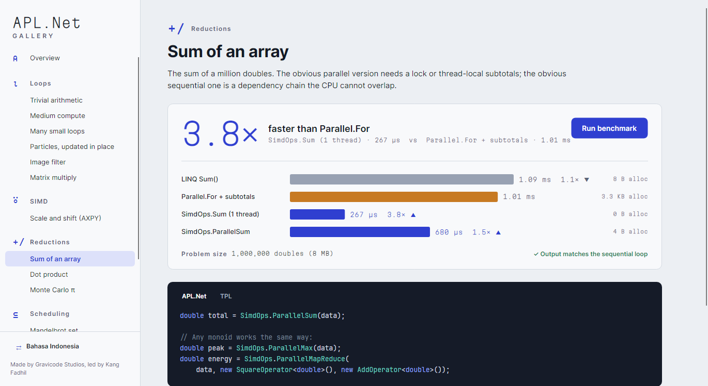

# SIMD (`AplNet.Simd`)

[Bahasa Indonesia](../id/simd.md) · [Index](README.md)

The JIT does not auto-vectorise loops. `SimdOps` does it explicitly. Inside each worker's
slice, it uses the widest vector the CPU accelerates:

| Path | Condition | floats per vector |
|---|---|---|
| `Vector512` | `Vector512.IsHardwareAccelerated` (AVX-512) | 16 |
| `Vector256` | `Vector256.IsHardwareAccelerated` (AVX2) | 8 |
| `Vector128` | `Vector128.IsHardwareAccelerated` (SSE, Arm AdvSimd) | 4 |
| scalar | none of the above, or an element type the vector types don't support | 1 |

The remainder after the last full vector always goes through the operator's scalar form. So
results never depend on the hardware, with one exception: floating-point *reductions* add in a
different order. `SimdCapabilities.Describe()` tells you which path is active. Every kernel is
tested at every path: CI reruns the suite with `DOTNET_EnableAVX512F=0`, `DOTNET_EnableAVX2=0`
and `DOTNET_EnableHWIntrinsic=0`.

## Operations

| Single-threaded (spans) | Parallel (arrays / `Memory<T>`) |
|---|---|
| `TransformInPlace(span, op)` | `ParallelTransformInPlace(array, op)` |
| `Transform(source, destination, op)` | `ParallelTransform(source, destination, op)` |
| `Transform(x, y, destination, binaryOp)` | `ParallelTransform(x, y, destination, binaryOp)` |
| `TransformInPlace(span, Func<Vector256<T>,…>, Func<T,T>)` | `ParallelTransformInPlace(array, vecFunc, scalarFunc)` |
| `Reduce(source, reduceOp)` | `ParallelReduce(source, reduceOp)` |
| `MapReduce(source, map, reduce)` | `ParallelMapReduce(source, map, reduce)` |
| `MapReduce(x, y, binaryMap, reduce)` | `ParallelMapReduce(x, y, binaryMap, reduce)` |
| `Sum`, `SumOfSquares`, `Min`, `Max`, `Dot` | `ParallelSum`, `ParallelMin`, `ParallelMax`, `ParallelDot` |

The element types are the primitive numerics that the .NET vector types support: at least
`float`, `double`, `int` and `long` (FR2), plus the other integer widths. The parallel methods
never give a worker fewer than **32,768** elements (`SimdOps.DefaultMinChunkSize`) unless
`AplOptions.MinChunkSize` says otherwise. A vector loop finishes that many floats in a few
microseconds, which is about what it costs to wake a pool thread.

Destinations may be exactly the same memory as a source (an in-place transform), but must not
partially overlap it. That case throws `ArgumentException`. `Min`/`Max` on an empty input throw
`InvalidOperationException`, like LINQ. `Sum` and `Reduce` of an empty input return the identity.

## Built-in operators

| Unary (`IUnaryOperator<T>`) | Binary (`IBinaryOperator<T>`) | Reductions (`IReduceOperator<T>`) |
|---|---|---|
| `IdentityOperator`, `NegateOperator`, `AbsOperator`, `SquareOperator`, `SqrtOperator`, `ScaleOperator(f)`, `AddScalarOperator(a)`, `MultiplyAddOperator(a, b)`, `ClampOperator(min, max)` | `AddOperator`, `SubtractOperator`, `MultiplyOperator`, `DivideOperator`, `MinOperator`, `MaxOperator` | `AddOperator` (sum), `MultiplyOperator` (product), `MinOperator`, `MaxOperator` |

`MultiplyAddOperator` computes a multiply and then an add, not a fused multiply-add, so it
matches the scalar expression bit for bit.

## Writing an operator

```csharp
/// c + a * b: the inner step of a matrix multiply.
readonly struct AddScaled(double a) : IBinaryOperator<double>
{
    public double Invoke(double c, double b) => c + a * b;
    public Vector128<double> Invoke(Vector128<double> c, Vector128<double> b) => c + Vector128.Create(a) * b;
    public Vector256<double> Invoke(Vector256<double> c, Vector256<double> b) => c + Vector256.Create(a) * b;
    public Vector512<double> Invoke(Vector512<double> c, Vector512<double> b) => c + Vector512.Create(a) * b;
}

SimdOps.Transform(cRow, bRow, cRow, new AddScaled(aik));
```

Each form is written out once per width. The interface has no default methods, because a
default interface method called on a struct runs on a boxed copy. A reduction operator also
provides `Identity` and a horizontal `Reduce(VectorN<T>)`.

## The delegate form

`TransformInPlace(data, v => v * Vector256.Create(a) + Vector256.Create(b), x => x * a + b)`
matches the spec's signature and is convenient. It costs a delegate call per vector, and uses the
scalar function everywhere when 256-bit vectors are not hardware-accelerated. Prefer an operator
struct in hot code.

## Why reductions are fast

`Sum` keeps four independent vector accumulators. The add's latency (about 4 cycles) would
otherwise let a sum finish only one vector every four cycles. With four accumulators, the
additions overlap. The parallel form gives each worker a private accumulator, placed a cache line
away from the others, and combines them in a fixed order. There is no lock and no `Interlocked`.


