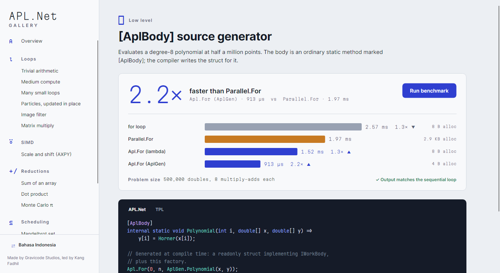

# Source generator

[Bahasa Indonesia](../id/source-generator.md) · [Index](README.md)

The struct-invoker API is fast, but you have to write a struct for every call site. The generator
in the `APL.Net` package writes that struct for you at compile time. No runtime reflection or code
generation is involved, so it also works under NativeAOT.

```csharp
using AplNet;

internal static class Kernels
{
    [AplBody]
    internal static void Scale(int i, double[] data, double factor) => data[i] *= factor;

    [AplRangeBody]
    internal static void Clear(int from, int to, int[] data) => Array.Clear(data, from, to - from);
}

Apl.For(0, data.Length, AplGen.Scale(data, 2.0));
Apl.ForRange(0, ints.Length, AplGen.Clear(ints));
```

## What gets generated

For each attributed method, the generator emits:

- `AplNet.Generated.__<Type>_<Method>_Generated`: a `readonly struct` that implements
  `IWorkBody` (or `IRangeWorkBody` for `[AplRangeBody]`). It has one readonly field per extra
  parameter, and an `AggressiveInlining` `Invoke` that calls your method.
- `AplNet.AplGen.<Method>(...)`: a factory that takes the extra parameters and returns the struct.

Because the struct's `Invoke` forwards to your method, the JIT inlines your method into the loop,
just as it does for a hand-written body.

## Rules and diagnostics

| Id | Rule |
|---|---|
| APL001 | The method must be `static` |
| APL002 | It must return `void` |
| APL003 | `[AplBody]`: the first parameter must be `int` (the index) |
| APL004 | `[AplRangeBody]`: the first two parameters must be `int, int` (the range) |
| APL005 | The method, and every type containing it, must not be generic |
| APL006 | The method, and every type containing it, must be `internal` or `public` (the generated struct lives outside them) |
| APL007 | Extra parameters cannot be `ref`/`out`/`in`, `params`, or ref structs such as `Span<T>`. Pass arrays or `Memory<T>` instead |
| APL008 | Two bodies would produce `AplGen` factories with the same name and parameter types |

Overloads that differ in their parameters are fine. Their generated structs are numbered.

## Using it from source (not the package)

An analyzer reference is not transitive, so add it explicitly:

```xml
<ProjectReference Include="../../src/APL.Net.SourceGen/APL.Net.SourceGen.csproj"
                  OutputItemType="Analyzer" ReferenceOutputAssembly="false" />
```


