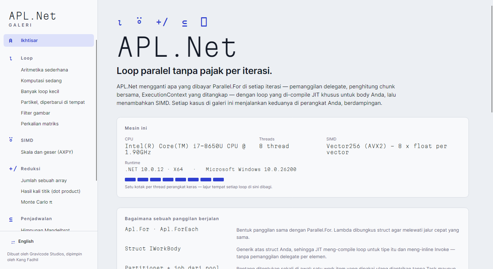

# Dokumentasi APL.Net

[English](../en/README.md)

APL.Net ("Another Parallel Library") menyediakan loop paralel-data untuk .NET tanpa overhead
per iterasi seperti `Parallel.For`. Pustaka ini juga menyediakan kernel SIMD, tingkat pointer
yang opt-in, dan sebuah source generator. Dibuat dan dikelola oleh **Gravicode Studios, dipimpin
oleh Kang Fadhil**.

| Halaman | Isi |
|---|---|
| [Memulai](getting-started.md) | Instalasi, lalu bertahap: delegate → struct body → range body → SIMD → unsafe |
| [Arsitektur](architecture.md) | Lima lapisan, dan perjalanan satu panggilan melewatinya |
| [Keputusan desain](design-decisions.md) | **Baca sebelum mengubah scheduler.** Alasan di balik setiap kompromi |
| [Panduan API](api-guide.md) | `Apl`, `AplOptions`, interface body, exception, dan pembatalan |
| [Partitioner](partitioners.md) | Partisi statis, bergaris (striped), dan work-stealing, serta cara memilihnya |
| [SIMD](simd.md) | `SimdOps`, struct operator, operator kustom, dan fallback perangkat keras |
| [Tingkat unsafe](unsafe.md) | `UnsafeParallel`, function pointer, dan `NativeBuffer<T>` |
| [Source generator](source-generator.md) | `[AplBody]` / `[AplRangeBody]` dan diagnostik APL001–APL008 |
| [Diagnostik](diagnostics.md) | Counter EventSource `AplNet` |
| [NativeAOT](native-aot.md) | Publish dengan AOT, dan lebar vektor yang didapat |
| [Galeri](gallery.md) | Aplikasi etalase Avalonia, dan cara screenshot-nya dibuat |
| [Hasil benchmark](benchmark-results.md) | Angka BenchmarkDotNet untuk B1–B7, ditambah referensi Rust/Rayon |
| [Pemecahan masalah & FAQ](troubleshooting.md) | Kapan tidak memakai APL.Net, dan hal-hal yang sering mengejutkan |

