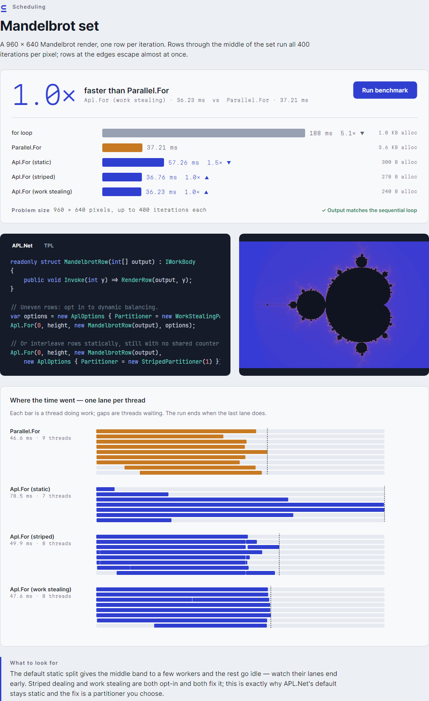

# Partitioner

[English](../en/partitioners.md) · [Indeks](README.md)

Partitioner menentukan cara `[0, n)` dibagi, sebelum pekerjaan dimulai. Pilihannya ditetapkan per
panggilan lewat `AplOptions.Partitioner`.

| Partitioner | Cara pembagian | Biaya saat berjalan | Paling cocok untuk |
|---|---|---|---|
| `StaticRangePartitioner` (default) | Satu potongan berurutan per worker, selisih ukuran ≤ 1 | 1 increment per partisi | Iterasi seragam (kebanyakan loop numerik) |
| `StripedPartitioner(stripe)` | Garis berukuran tetap dibagi bergiliran: worker *w* mendapat garis *w*, *w+W*, … | 1 increment per partisi | Biaya yang berubah perlahan mengikuti indeks; lokalitas |
| `WorkStealingPartitioner(grain)` | Mulai statis; pemilik mengambil grain dari depan, worker yang menganggur mencuri separuh belakang rentang terpenuh | 1 CAS per grain, 1 CAS per curian | Biaya timpang atau tidak terduga |
| `IPartitioner` buatan sendiri | Rencana tetap apa pun | 1 increment per partisi | Tata letak khusus |



## Statis

```csharp
Apl.For(0, n, body);   // StaticRangePartitioner.Instance
```

Pilihan termurah dan default yang tepat. Kelemahannya ada di keseimbangan beban: worker yang
memegang bagian mahal dari rentang selesai paling akhir. Lihat
[keputusan desain §1](design-decisions.md#1-partisi-statis-sebagai-default).

## Striped (bergaris)

```csharp
var options = new AplOptions { Partitioner = new StripedPartitioner(stripeSize: 64) };
```

Setiap worker mendapat irisan dari setiap wilayah rentang. Jika biaya bergantung pada posisi
(baris tengah gambar Mandelbrot, baris panjang pada matriks segitiga), setiap worker jadi mendapat
bagian yang adil dari wilayah yang mahal. Tetap tidak ada penghitung bersama selama loop berjalan.
Pilih ukuran garis yang cukup besar agar biaya panggilan per garis teramortisasi. Untuk array
dengan elemen 4 byte, kelipatan 16 menjaga garis tetap rata dengan cache line.

## Work stealing

```csharp
var options = new AplOptions { Partitioner = new WorkStealingPartitioner(minGrainSize: 1) };
```

Ini bentuk rentang indeks dari deque Chase-Lev. Sisa rentang `[start, end)` milik setiap worker
disimpan dalam satu word 64-bit, masing-masing di cache line sendiri:

- **Pemilik** mengambil `grain` iterasi dari depan dengan satu CAS.
- Worker yang kehabisan pekerjaan menjadi **pencuri**. Ia mencari rentang terpenuh, memangkasnya
  dengan CAS menjadi separuh depannya, lalu memindahkan separuh belakangnya ke slot miliknya.
  Mencuri separuh sisa pekerjaan hanya butuh satu CAS, berapa pun banyaknya pekerjaan itu.
- Saat terjadi kegagalan atau pembatalan, worker mengosongkan semua slot sambil menghitung iterasi
  yang ditinggalkan, supaya pemanggil berhenti menunggu.

`minGrainSize: 0` (default untuk `WorkStealingPartitioner.Instance`) memilih
`max(1, n / (workers * 1024))`. Gunakan `1` jika satu iterasi mahal (baris gambar, dokumen,
simulasi). Gunakan grain besar jika iterasinya murah, karena setiap grain butuh satu CAS.

## Membuat partitioner sendiri

```csharp
public sealed class EveryOtherBlock : IPartitioner
{
    public int GetPartitionCount(int length, int maxWorkers) => Math.Min(length, maxWorkers * 4);

    public bool TryGetRange(int length, int partitionCount, int partition, int index,
                            out int from, out int to) { /* sub-rentang ke-index dari partisi */ }
}
```

Aturannya:

- Gabungan sub-rentang semua partisi harus mencakup `[0, length)` tepat satu kali.
- Kedua method harus deterministik dan thread-safe.
- Jumlah partisi boleh lebih banyak dari jumlah worker. Worker akan mengklaimnya satu per satu, yang
  berarti penyeimbangan dinamis kasar yang Anda pilih sendiri.
- Mengembalikan 0 partisi melempar `InvalidOperationException`.

## Cara memilih dalam praktik

1. Mulai dengan default.
2. Jika lane chart di Galeri (atau profiler) menunjukkan sebagian lajur selesai jauh lebih awal dari
   yang lain, coba `StripedPartitioner` dulu, karena tidak menambah biaya saat loop berjalan.
3. Jika biayanya timpang tetapi tidak bergantung posisi (mirip Zipf, bergantung pada data), gunakan
   `WorkStealingPartitioner(1)`.

Hasil pengukuran di mesin referensi ([B6](benchmark-results.md)): dengan item termahal di depan,
partisi statis kalah dari `Parallel.For`, sedangkan work stealing mengalahkannya.
