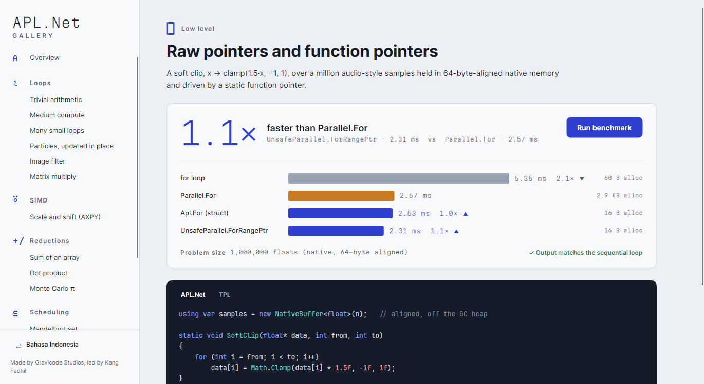

# Tingkat unsafe (`AplNet.Unsafe`)

[English](../en/unsafe.md) · [Indeks](README.md)

> **PERINGATAN.** Tidak ada satu pun alamat di namespace ini yang diperiksa. Salah hitung satu
> indeks di sini merusak memori, bukan melempar exception. Gunakan tingkat ini hanya jika data Anda
> memang sudah berada di memori native, atau jika profiler membuktikan pengecekan batas di range
> body benar-benar berpengaruh.

## `UnsafeParallel`

| Method | Tanda tangan body | Frekuensi panggilan |
|---|---|---|
| `ForPtr(double* p, int n, delegate*<double*, int, void>, int? maxDop)` | `(p, i)` | sekali per elemen (tanda tangan dari spesifikasi) |
| `ForPtr<T>(T* p, int n, delegate*<T*, int, void>, AplOptions?)` | `(p, i)` | sekali per elemen |
| `ForRangePtr<T>(T* p, int n, delegate*<T*, int, int, void>, AplOptions?)` | `(p, from, to)` | sekali per potongan |
| `For(void* ctx, int from, int to, delegate*<void*, int, int, void>, AplOptions?)` | `(ctx, from, to)` | sekali per potongan; `ctx` biasanya menunjuk struct berisi pointer |

Body berupa method **statis** yang diambil dengan `&Method`. Function pointer tidak mengalokasi
dan tidak bisa menangkap variabel. Penjadwalan, opsi, dan partitioner sama dengan API yang aman.

**Pemanggil menjamin** setiap alamat yang disentuh body tetap valid dan ter-pin sampai method
selesai. Gunakan `fixed`, `GCHandle`, `NativeMemory`, atau `NativeBuffer<T>`.

```csharp
[StructLayout(LayoutKind.Sequential)]
unsafe struct AddJob { public float* X, Y, Dst; }

static unsafe void Add(void* ctx, int from, int to)
{
    var job = (AddJob*)ctx;
    for (int i = from; i < to; i++)
        job->Dst[i] = job->X[i] + job->Y[i];
}

fixed (float* x = xs, y = ys, d = dst)
{
    var job = new AddJob { X = x, Y = y, Dst = d };
    UnsafeParallel.For(&job, 0, n, &Add);
}
```

**Exception.** Exception terkelola dari body berupa pointer dikumpulkan menjadi
`AggregateException`, sama seperti di API yang aman. Berbeda dengan sketsa di spesifikasi, proses
tidak dihentikan: blok `try` tidak berbiaya sampai ada yang dilempar, jadi tidak ada yang
dikorbankan. Access violation tetap tidak bisa ditangkap dan akan menghentikan proses.

## `NativeBuffer<T>`

```csharp
using var buffer = new NativeBuffer<float>(1_000_000);   // diisi nol, rata 64 byte
float* p = buffer.Pointer;
Span<float> s = buffer.Span;
Memory<float> m = buffer.Memory;                           // untuk SimdOps.Parallel* dan Apl.ForEach
ref float first = ref buffer[0];                           // indexer memeriksa batas
```

- Memori dialokasikan dengan `NativeMemory.AlignedAlloc`: tidak pernah dipindah maupun dipindai GC,
  dan rata dengan cache line (juga dengan satu vektor AVX-512).
- `Dispose` membebaskan memori. Jika lupa, finalizer yang membebaskannya, tetapi hanya ketika GC
  sempat menjalankannya.
- Setelah dispose, `Pointer`, `Span`, dan `Memory` melempar `ObjectDisposedException`. Pointer yang
  sudah diambil sebelumnya tidak ikut dicegah.

## Kapan sepadan

Di kasus *Raw pointers* pada Galeri, `ForRangePtr` hasilnya dekat dengan struct body yang aman.
Itu memang yang diharapkan: API aman sudah menghapus overhead per elemen, dan JIT sering mengangkat
pengecekan batas keluar dari loop span. Tingkat pointer ditujukan untuk kode yang banyak berinterop,
misalnya data dari pustaka native, file memory-mapped, atau buffer staging GPU yang tidak ingin Anda
salin ke array terkelola.


