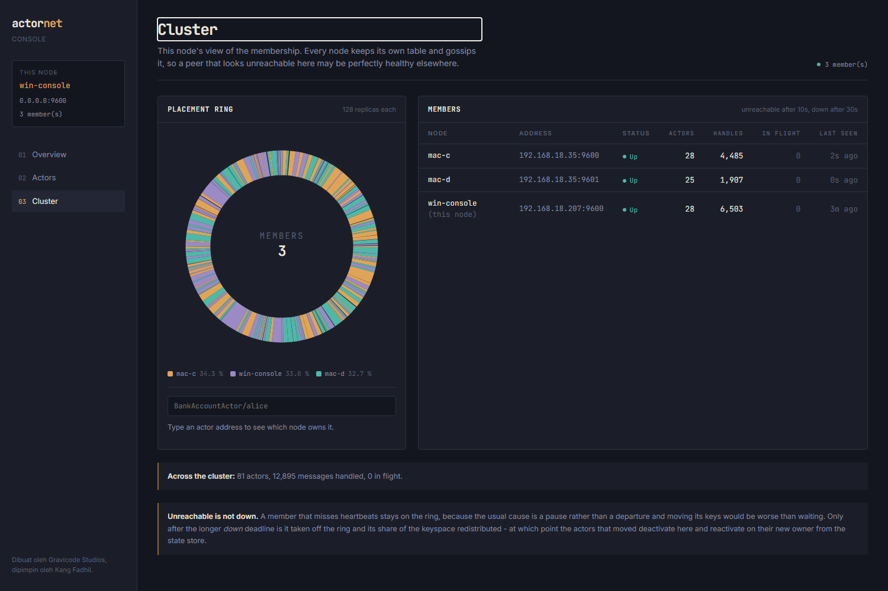

# Clustering

*Dibuat oleh Gravicode Studios, dipimpin oleh Kang Fadhil.*
*[Bahasa Indonesia](../id/06-clustering.md) · [Docs index](README.md)*

## Starting one

```bash
actornet run --node-id node-a --port 9000 --cluster
actornet run --node-id node-b --port 9001 --seed 127.0.0.1:9000
actornet run --node-id node-c --port 9002 --seed 127.0.0.1:9000
```

The first node needs `--cluster`. It has no seeds of its own, and without the flag it runs
standalone: it will answer a join handshake but never gossip, so its peers eventually mark a
perfectly healthy node unreachable.

In code:

```csharp
options.Cluster.Enabled = true;
options.Cluster.Seeds = ["10.0.1.4:9000", "10.0.1.5:9000"];
```

Any one reachable seed is enough — the joiner receives the whole member table and gossips from
there. List two or three so a restart does not depend on one machine being up.

## What you see



Three members, each with 128 replicas on the ring, owning 36.2%, 32.3% and 31.6% of the keyspace.
The stripes are the virtual nodes, and their interleaving is the whole point — see below.

## Placement: the hash ring

Every actor address is hashed onto a 64-bit ring. Each member is placed at `VirtualNodesPerMember`
positions, and a key belongs to the first position at or after its hash.

```csharp
var owner = system.Cluster.OwnerOf(ActorId.For<BankAccountActor>("alice"));
var mine  = system.Cluster.IsLocal(ActorId.For<BankAccountActor>("alice"));
```

**Why consistent hashing rather than `hash % memberCount`?** Because of what happens when
membership changes. Modulo reshuffles almost everything: going from 3 nodes to 4 moves about 3/4 of
the keys. Consistent hashing moves about 1/N — measured at 15–35% for that transition, with a test
asserting it stays in that band. Every key that moves is an actor that has to deactivate here and
reactivate there, so the difference is the difference between a rebalance and an outage.

**Why 128 virtual nodes?** With one position per member the split is wildly uneven — where the
three random points happen to land decides everything. Replicas average that out. At 128 the worst
share on a 3-node cluster is within a few percent of even, and the test asserts under 15% deviation.

**Why the hash is what it is.** FNV-1a over UTF-8, then the MurmurHash3 finalizer. Two properties
matter:

- *Process-independent.* `string.GetHashCode()` is randomised per process, so two nodes would build
  different rings from the same member list and disagree about ownership. That bug only appears in
  a real cluster. The hash is pinned in a test against known vectors.
- *Well-avalanched.* Raw FNV-1a clusters badly on short strings sharing a prefix — which is exactly
  what ring positions are (`node-1#0`, `node-1#1`, …). Measured, one node took 48% of the keyspace.
  The finalizer fixed it.

## Membership

A small protocol:

1. A joiner sends `Join` to each seed.
2. A seed answers `JoinAck` with its whole member table.
3. From then on every node periodically sends its whole table to every peer it knows.

That converges, and it costs O(members²) beats per interval — nothing at tens of nodes, and in need
of a fanout limit beyond that. It is on the roadmap, and it is a real ceiling today.

### Statuses

| Status | On the ring? | Meaning |
| --- | --- | --- |
| `Joining` | no | Seen, handshake not finished |
| `Up` | yes | Healthy |
| `Unreachable` | **yes** | Missed heartbeats |
| `Down` | no | Given up on; keys redistributed |
| `Leaving` | no | Shutting down gracefully |

**Unreachable stays on the ring.** The usual cause of a missed heartbeat is a GC pause or a network
blip, and moving a node's keys costs a wave of deactivations and reactivations. Waiting is cheaper
than being wrong.

```csharp
options.Cluster.HeartbeatInterval = TimeSpan.FromSeconds(2);
options.Cluster.UnreachableAfter  = TimeSpan.FromSeconds(10);   // suspicious, still routed to
options.Cluster.DownAfter         = TimeSpan.FromSeconds(30);   // off the ring
```

`Validate()` refuses `DownAfter <= UnreachableAfter` (a short pause would evict a healthy node) and
`HeartbeatInterval >= UnreachableAfter` (a node would be declared unreachable before its next beat
was due).

### Incarnation numbers

Each node's entry carries a monotonic counter. A node's own view of itself always wins: if a peer
gossips that this node is unreachable, it bumps its incarnation and refutes the claim everywhere
that spreads.

Third-party news only wins with a strictly newer incarnation — otherwise first-hand contact stands.
This is the one piece of SWIM worth having without the rest of it.

## Rebalancing

When membership changes, actors whose keys no longer belong here are deactivated:

```csharp
options.Cluster.RebalanceOnMembershipChange = true;   // default
```

That is the elastic half of elastic scaling. Deactivation flushes state, and the next message
activates the actor on its new owner from the store — so scaling out migrates roughly 1/N of the
actors and nothing else moves.

**It requires a store both nodes can read.** With the default in-memory store - or the file and
SQLite ones, which are per-process - an actor that moves finds nothing. Use PostgreSQL, SQL Server,
MySQL or Redis; see [Persistence](05-persistence.md).

**In-memory-only state does not survive a rebalance.** Migrating live state would mean a
distributed handover protocol; the store already solves the problem.

## Sending across nodes

Nothing in your code changes:

```csharp
await system.TellAsync(ActorId.For<BankAccountActor>("alice"), new Deposit(100m));
```

The ring decides. Local: a channel write. Remote: serialize, and hand to the transport. An ask
works the same way — the reply travels back on the answering node's own connection and is matched
by correlation id, not by which socket the request arrived on.

An inbound remote message is always delivered locally, even if the ring has since moved that key.
The sender routed with the view it had, and bouncing it onward risks a loop between two nodes that
disagree during a rebalance.

## The transport

One TCP listener, one persistent outbound connection per peer.

Connections are long-lived on purpose. A connection per message costs a handshake every time and,
on Windows, burns through the ephemeral port range under load — the failure mode is a node that
works in a demo and dies in a benchmark. Writes are serialized per connection, because two threads
writing to one socket would interleave their bytes into frames neither of them sent.

Reconnection uses capped exponential backoff: a node down for an hour should not be dialled
thousands of times a second, and one down for 200 ms should not wait a minute.

## Deploying

- **`NodeId` must be stable and unique.** It is what the ring hashes, so a node that comes back
  under a different id takes a different slice of the keyspace. In Kubernetes, use the pod name
  from a StatefulSet, not a random one.
- **`Host` and `Port` must be reachable by peers**, not just bound locally. Peers dial the address
  a node advertises.
- **Seeds are static strings today.** Discovery through DNS or the Kubernetes API is on the
  roadmap.
- **TLS and authentication are available but off by default.** See below. Until they are on, run
  the cluster on a trusted network - the type allow-list limits what a peer can make a node
  construct, but it is not a substitute for a closed network.

## Deploying across machines

`Host` does double duty: it is the address the listener binds to **and** the address peers are told
to dial. That has one consequence worth knowing before you deploy.

### Separate machines or VMs

Set `Host` to an address that machine actually owns and peers can route to:

```bash
# on the machine at 10.0.1.5
actornet run --node-id a --host 10.0.1.5 --port 9000 --cluster

# on the machine at 10.0.1.6
actornet run --node-id b --host 10.0.1.6 --port 9000 --seed 10.0.1.5:9000
```

Verified on a real network interface rather than loopback: two nodes bound to a LAN address
converged and each saw the other `Up`.

### Docker or Kubernetes

Use a name the other containers can resolve:

```yaml
services:
  node-a:
    command: run --node-id a --host node-a --port 9000 --cluster
  node-b:
    command: run --node-id b --host node-b --port 9000 --seed node-a:9000
```

A `Host` that is not parseable as an IP makes the listener bind to all interfaces while still
advertising the name, which is exactly what a container needs. Verified with a hostname on one
machine; not yet verified across real containers.

### Binding one address and advertising another

`Host` and `Port` are what the listener binds. `AdvertisedHost` and `AdvertisedPort` are what peers
are told to dial. Leave the advertised pair unset and the bind pair is used, which is right whenever
a node binds to an address peers can already route to.

They differ in two common cases:

```bash
# Accept on every interface, but tell peers a routable address.
actornet run --node-id a --host 0.0.0.0 --advertised-host 10.0.1.5 --port 9000 --cluster

# Bind 9000 inside a container that publishes it as 19000.
actornet run --node-id a --host 0.0.0.0 --advertised-host node-a.example.com   --port 9000 --advertised-port 19000 --cluster
```

Verified: two nodes bound to `0.0.0.0`, advertising a LAN address, converged with no failed
connection attempts.

**Advertising a bind address is refused at startup.** `0.0.0.0`, `::` and `*` mean "every
interface" to a listener and nothing at all to a dialler, so a clustered node configured that way
fails immediately with a message naming the fix — rather than starting, being discovered once, and
then being marked `Unreachable` while perfectly healthy.

A port of `0` is fine: the real port is only known once the listener is up, and that is what gets
advertised.

## Securing a cluster

Both encryption and authentication are off by default, which is why the deployment notes say to keep
a cluster on a trusted network until they are on. They answer different questions and are
independent.

### Authentication: a shared secret

```bash
actornet run --node-id a --port 9000 --cluster --secret "$ACTORNET_SECRET"
actornet run --node-id b --port 9001 --seed 10.0.1.5:9000 --secret "$ACTORNET_SECRET"
```

```csharp
options.Security.SharedSecret = Environment.GetEnvironmentVariable("ACTORNET_SECRET");
```

**The secret is never sent.** The listening side offers a random nonce, the connecting side answers
with an HMAC of it, and the answer is compared in constant time. A passive observer learns a nonce
and a MAC, neither of which is reusable — so this is safe to run without TLS, and an operator can
turn on authentication without first solving certificate distribution.

This is what stops an *unauthorised process* joining the cluster. Without it, anything that can
reach the port can send a `Join` and start receiving actors. Secrets under 16 characters are refused
at startup.

Verified: a node started with the wrong secret never appears in the member table, and the refusal is
logged on the node that rejected it.

### Encryption: TLS

```bash
actornet run --node-id a --port 9000 --cluster   --tls-cert ./node.pfx --tls-password "$PFX_PASSWORD" --tls-pin A1B2C3...
```

```csharp
options.Security.ServerCertificate = X509CertificateLoader.LoadPkcs12FromFile("node.pfx", password);
options.Security.PinnedThumbprint("A1B2C3…");     // or supply RemoteCertificateValidation
```

TLS 1.2 or 1.3, negotiated before a single frame is read.

Cluster nodes usually serve certificates from a private CA or self-signed ones, which the platform
default will refuse — so pin a thumbprint, or supply your own validation. `AcceptAnyCertificate()`
exists for development and is a named method rather than a flag precisely so it is greppable in a
review: it encrypts the traffic and authenticates nobody.

**Every node must agree about TLS.** A node with it on cannot talk to one with it off, and the
failure is a handshake error rather than anything subtle — a half-migrated cluster fails loudly.
Roll the certificate out everywhere before enabling it anywhere.

### Mutual TLS

```csharp
options.Security.RequireClientCertificate = true;
options.Security.ClientCertificate = X509CertificateLoader.LoadPkcs12FromFile("node.pfx", password);
```

The strongest option and the most work: every node needs a key pair and a rotation story. The shared
secret is the cheaper answer to the same question, and the two can be combined.

## Known limits

- **Split brain is unresolved.** Two halves of a partition each believe they own the whole ring,
  which means two activations of the same actor.
- **Membership is quadratic** in the number of members per heartbeat round.
- **Failure detection is a fixed deadline**, not phi-accrual. It will call a long GC pause a
  failure; `UnreachableAfter` keeping such a node on the ring is the mitigation.
- **`PreferenceList` exists and nothing uses it.** Replica placement is not implemented.

All four are in the [roadmap](../../Plan.md).

## Next

- [Persistence](05-persistence.md) — why a shared store is the prerequisite
- [Tooling](09-tooling.md) — watching a cluster converge
