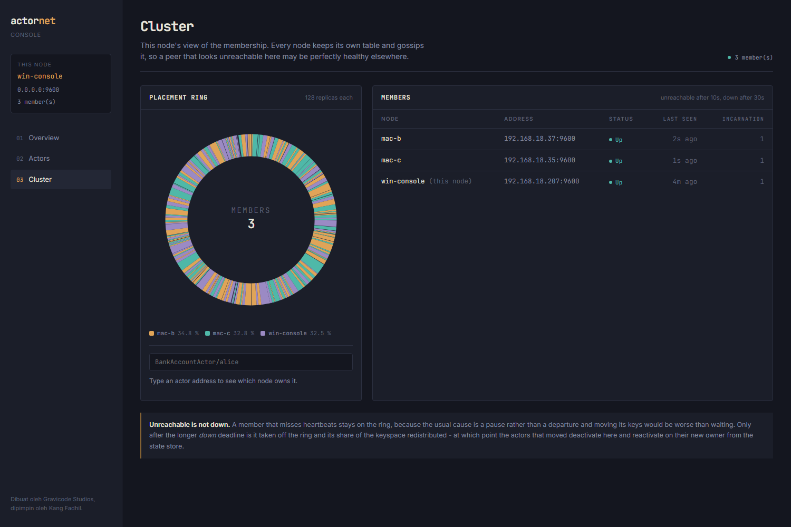

# Clustering

*Dibuat oleh Gravicode Studios, dipimpin oleh Kang Fadhil.*
*[Bahasa Indonesia](../id/06-clustering.md) · [Docs index](README.md)*

## Starting one

```bash
actornet run --node-id node-a --port 9000 --cluster
actornet run --node-id node-b --port 9001 --seed 127.0.0.1:9000
actornet run --node-id node-c --port 9002 --seed 127.0.0.1:9000
```

The first node needs `--cluster`. It has no seeds of its own, and without the flag it runs
standalone: it will answer a join handshake but never gossip, so its peers eventually mark a
perfectly healthy node unreachable.

In code:

```csharp
options.Cluster.Enabled = true;
options.Cluster.Seeds = ["10.0.1.4:9000", "10.0.1.5:9000"];
```

Any one reachable seed is enough — the joiner receives the whole member table and gossips from
there. List two or three so a restart does not depend on one machine being up.

## What you see


Three members, each with 128 replicas on the ring, owning 34.3%, 33.0% and 32.7% of the keyspace.
The stripes are the virtual nodes, and their interleaving is the whole point — see below.

The counters beside each member come from that member, not from this node. `GetClusterStatusAsync`
asks every reachable peer for its own numbers and returns them together:

```csharp
var status = await system.GetClusterStatusAsync(TimeSpan.FromSeconds(2));

status.ActiveActors;   // across the cluster
status.Busiest;        // the node carrying the most in-flight work
status.Silent;         // members that did not answer in time
```

The ring and the member table were always cluster-wide and the counters were not, so a console could
report five members and only what one of them was doing — and a node buried under work looks exactly
like an idle one from three nodes away. **The cluster total is not the interesting number**;
`Busiest` is, because one node buried while the others idle is a placement problem that a sum hides.

**A peer that does not answer is named rather than dropped.** Summing four nodes and presenting the
result as five would be worse than saying which one is missing, and a peer going quiet is itself
what somebody looking at this page wants to know. The console shows an em dash in its row.

Asking costs a round trip per peer, so the console asks less often than it redraws. A page that
polled a twenty-node cluster every second would become a load generator for the thing it is meant
to be observing.

## Placement: the hash ring

Every actor address is hashed onto a 64-bit ring. Each member is placed at `VirtualNodesPerMember`
positions, and a key belongs to the first position at or after its hash.

```csharp
var owner = system.Cluster.OwnerOf(ActorId.For<BankAccountActor>("alice"));
var mine  = system.Cluster.IsLocal(ActorId.For<BankAccountActor>("alice"));
```

**Why consistent hashing rather than `hash % memberCount`?** Because of what happens when
membership changes. Modulo reshuffles almost everything: going from 3 nodes to 4 moves about 3/4 of
the keys. Consistent hashing moves about 1/N — measured at 15–35% for that transition, with a test
asserting it stays in that band. Every key that moves is an actor that has to deactivate here and
reactivate there, so the difference is the difference between a rebalance and an outage.

**Why 128 virtual nodes?** With one position per member the split is wildly uneven — where the
three random points happen to land decides everything. Replicas average that out. At 128 the worst
share on a 3-node cluster is within a few percent of even, and the test asserts under 15% deviation.

**Why the hash is what it is.** FNV-1a over UTF-8, then the MurmurHash3 finalizer. Two properties
matter:

- *Process-independent.* `string.GetHashCode()` is randomised per process, so two nodes would build
  different rings from the same member list and disagree about ownership. That bug only appears in
  a real cluster. The hash is pinned in a test against known vectors.
- *Well-avalanched.* Raw FNV-1a clusters badly on short strings sharing a prefix — which is exactly
  what ring positions are (`node-1#0`, `node-1#1`, …). Measured, one node took 48% of the keyspace.
  The finalizer fixed it.

## Membership

A small protocol:

1. A joiner sends `Join` to each seed.
2. A seed answers `JoinAck` with its whole member table.
3. From then on every node periodically sends its whole table to every peer it knows.

### Fanout

Step 3 does not mean everybody, or the cost would be O(members²) frames per interval — nothing at
ten nodes and ruinous at a hundred. Each beat gossips to `GossipFanout` peers (4 by default), and
the information reaches the rest second-hand:

```csharp
options.Cluster.GossipFanout = 4;   // 0 means every peer, which is what a small cluster gets anyway
```

Below the fanout there is nothing to limit, so a cluster of five behaves exactly as before. Above
it, convergence takes about log(members) rounds rather than one, which at a two-second beat is a
few seconds for a cluster of a hundred.

**Peers are taken in rotation, not at random.** A random subset is the textbook choice and it is
the wrong one here, because the gap between two particular nodes then becomes a coin flip — and the
failure detector, which learns how often it hears from each peer, cannot learn a coin flip. It
would have to be made tolerant of a silence that was merely unlucky, which is exactly the tolerance
that makes a detector slow. A rotation makes the gap exactly `ceil(peers / fanout)` beats, and the
detector is told that number so a newly discovered member is not suspected before its window has
filled.

### Nodes may start in any order

Step 1 is retried. A node with seeds configured that can see no peer at all sends `Join` again on
every heartbeat, so a node whose seeds were not up yet joins as soon as one of them is:

```
Join sent to 0 of 1 seeds.        # nothing is listening on the seed's port yet
Still alone; reached 0 of 1 seeds. # once per heartbeat, at debug level
cluster: mac-c:Up, win-a:Up        # the seed came up and the join landed
```

Retrying stops the moment any peer is on the ring, and an `Unreachable` peer counts — it is expected
back, so re-seeding on a blip would be churn rather than recovery. This only matters off the
loopback: a local connection to a closed port is refused instantly and the old startup-only
handshake usually won the race, while over a real network the same connect fails in ways that make
the one attempt a coin toss.

### Statuses

| Status | On the ring? | Meaning |
| --- | --- | --- |
| `Joining` | no | Seen, handshake not finished |
| `Up` | yes | Healthy |
| `Unreachable` | **yes** | Missed heartbeats |
| `Down` | no | Given up on; keys redistributed |
| `Leaving` | no | Shutting down gracefully |

**Unreachable stays on the ring.** The usual cause of a missed heartbeat is a GC pause or a network
blip, and moving a node's keys costs a wave of deactivations and reactivations. Waiting is cheaper
than being wrong.

### How silence is judged

Two detectors, and the default is the adaptive one.

```csharp
options.Cluster.FailureDetection = FailureDetection.PhiAccrual;   // the default
options.Cluster.PhiUnreachableThreshold = 8;                      // suspicious, still routed to
options.Cluster.PhiDownThreshold        = 12;                     // off the ring
options.Cluster.AcceptableHeartbeatPause = TimeSpan.FromSeconds(3);
options.Cluster.MinimumStandardDeviation = TimeSpan.FromMilliseconds(100);
options.Cluster.HeartbeatSampleSize      = 200;
```

Phi is a measure of surprise, not a stopwatch: it is roughly how many nines of confidence this
node has that a peer this quiet has stopped, judged against how long that peer's beats have
actually been taking. Phi 8 means "wrong about one time in 10^8, given this peer's own history".

The point of measuring is that one threshold then means different things on different links. A peer
across a wireless hop whose beats vary by half a second is given that slack; a peer on the same
switch beating every 200ms is suspected far sooner, because for *it* a two-second silence is
genuinely abnormal. A fixed deadline has to be set for the worst link in the cluster and is
therefore too slow everywhere else — on the three-machine test that motivated this, healthy nodes
crossed a fixed ten-second deadline that a co-located pair would not have crossed in a minute.

`AcceptableHeartbeatPause` is the stop-the-world allowance, added to the mean before suspicion
begins. Without it, a peer whose beats are metronomic has almost no measured spread, and a GC pause
a fraction of a second past its usual interval reads as a failure. `MinimumStandardDeviation` is the
same defence from the other side: a floor on the spread, so phi cannot leap from nothing to enormous
within a millisecond.

The fixed deadlines remain, for when a flat stated number is worth more than accuracy — a test that
wants a node down at a known second, most of all:

```csharp
options.Cluster.FailureDetection  = FailureDetection.Deadline;
options.Cluster.HeartbeatInterval = TimeSpan.FromSeconds(2);
options.Cluster.UnreachableAfter  = TimeSpan.FromSeconds(10);   // suspicious, still routed to
options.Cluster.DownAfter         = TimeSpan.FromSeconds(30);   // off the ring
options.Cluster.JoinTimeout       = TimeSpan.FromSeconds(5);    // how long starting waits on seeds
```

`Validate()` refuses `DownAfter <= UnreachableAfter` (a short pause would evict a healthy node),
`HeartbeatInterval >= UnreachableAfter` (a node would be declared unreachable before its next beat
was due), and `PhiDownThreshold <= PhiUnreachableThreshold` (a peer would be taken off the ring
without ever being given the benefit of the doubt).

`JoinTimeout` bounds startup only. Seeds are contacted at once rather than in turn, so one seed
behind a firewall that drops packets cannot starve the others, and when the deadline passes the
node comes up alone and keeps retrying. A node that has not finished starting cannot serve the
actors it already owns, which is worse than being briefly alone.

### When the cluster splits in two

A partition looks the same from both sides: half the members stop answering, and the half you are
standing in looks healthy. Left alone, both halves take the other's keys, and the same actor is
activated twice with two versions of its state that will never be reconciled.

Nothing is done about that unless you ask for it:

```csharp
options.Cluster.SplitBrainStrategy = SplitBrainStrategy.KeepMajority;
options.Cluster.SplitBrainStabilityWindow = TimeSpan.FromSeconds(7);
```

| Strategy | A side survives if |
| --- | --- |
| `None` (default) | Always. Both halves keep serving. |
| `KeepMajority` | It can see more than half of the last agreed membership |
| `StaticQuorum` | It can see at least `StaticQuorumSize` members |

From the CLI it is two flags:

```bash
actornet run --node-id a --host 10.0.1.5 --port 9000 --cluster --split-brain keep-majority
actornet run --node-id b --host 10.0.1.6 --port 9000 --seed 10.0.1.5:9000 \
             --split-brain static-quorum --quorum 3
```

The losing side takes itself off the ring and **stops**. That is not a failure to handle: a node
that keeps serving actors it no longer owns is the thing the strategy exists to prevent. Rejoining
means starting the node again.

Three details carry the weight:

**Majority is counted against the last membership everyone agreed on**, not against what a side can
currently see. Otherwise each half would count itself a majority of itself. Nodes that joined after
the split do not get a vote either, or a minority could manufacture a majority by starting nodes.

**An even split is settled by the lowest node id.** Without that, a two-node cluster would lose both
halves to one broken link, which is worse than the split brain being guarded against.

**A member that left gracefully is not a missing half.** Departures are remembered separately from
failures; otherwise scaling a cluster down would read as a partition and the survivors would shut
themselves off.

The window is what stops a decision being made against a membership still in motion — a partition
is rarely a clean cut, and nodes drop out over several seconds. It costs the losing side that much
extra availability and buys deciding once.

This is the honest limit of it: the decision is made from one node's view, and there is no protocol
between the halves. Two sides that disagree about who is reachable can both decide they are the
majority, which is why `StaticQuorum` is the safer choice when the cluster size is fixed.

### Incarnation numbers

Each node's entry carries a monotonic counter. A node's own view of itself always wins: if a peer
gossips that this node is unreachable, it bumps its incarnation and refutes the claim everywhere
that spreads.

Third-party news only wins with a strictly newer incarnation — otherwise first-hand contact stands.
This is the one piece of SWIM worth having without the rest of it.

## Rebalancing

When membership changes, actors whose keys no longer belong here are deactivated:

```csharp
options.Cluster.RebalanceOnMembershipChange = true;   // default
```

That is the elastic half of elastic scaling. Deactivation flushes state, and the next message
activates the actor on its new owner from the store — so scaling out migrates roughly 1/N of the
actors and nothing else moves.

**It requires a store both nodes can read.** With the default in-memory store - or the file and
SQLite ones, which are per-process - an actor that moves finds nothing. Use PostgreSQL, SQL Server,
MySQL or Redis; see [Persistence](05-persistence.md).

**In-memory-only state does not survive a rebalance.** Migrating live state would mean a
distributed handover protocol; the store already solves the problem.

### Taking a node out on purpose

Stopping a node is not the same event as losing one, and it gets the one thing a failure cannot
offer: the chance to put its actors' state where the next owner will look **before** telling anyone
it is going.

`StopAsync` therefore runs in this order:

1. Deactivate every live actor and wait for them, which flushes their state.
2. Announce the leave, so peers take this node off the ring.
3. Drain once more, for anything that activated while step 1 was running — this node still owned
   those keys and was right to serve them.
4. Ask each successor to activate the actors it has just inherited.
5. Close the transport.

The order is the whole point. Announcing first means a peer rebuilds its ring and the first message
to a key that moved reactivates that actor from a store this node has not written to yet: the new
activation starts from a stale version, and the flush still to come lands on top of whatever it went
on to do. On an in-memory store that window is microseconds and you will never see it; on a database
across a network it is however long a write takes.

Then it hands the actors over. For each key that is moving, the departing node works out who takes
it — the entry after itself in the ring's preference list — and asks that node to activate it now:

```csharp
options.WarmHandoffLimit = 1000;   // 0 turns it off
```

Without this, the first message to every key that moved pays a read from the store, and on a rolling
restart that is every actor the node held, all at once, at the moment traffic arrives. With it the
successor is already holding them.

It is best effort throughout. A successor that does not answer activates on demand later, which is
what would have happened anyway, and a node on its way out is the wrong place to insist on anything.
The cap is there because it is one message per actor and a node can hold a great many; past it the
rest activate on demand.

That makes a rolling restart both safe and warm. What is still missing is a *rolling upgrade* in the
larger sense: nothing coordinates the order nodes go down in, so taking two out at once is still
something an operator has to avoid rather than something the cluster refuses.

## Sending across nodes

Nothing in your code changes:

```csharp
await system.TellAsync(ActorId.For<BankAccountActor>("alice"), new Deposit(100m));
```

The ring decides. Local: a channel write. Remote: serialize, and hand to the transport. An ask
works the same way — the reply travels back on the answering node's own connection and is matched
by correlation id, not by which socket the request arrived on.

An inbound remote message is always delivered locally, even if the ring has since moved that key.
The sender routed with the view it had, and bouncing it onward risks a loop between two nodes that
disagree during a rebalance.

## The transport

One TCP listener, one persistent outbound connection per peer.

Connections are long-lived on purpose. A connection per message costs a handshake every time and,
on Windows, burns through the ephemeral port range under load — the failure mode is a node that
works in a demo and dies in a benchmark. Writes are serialized per connection, because two threads
writing to one socket would interleave their bytes into frames neither of them sent.

Reconnection uses capped exponential backoff: a node down for an hour should not be dialled
thousands of times a second, and one down for 200 ms should not wait a minute.

## Deploying

- **`NodeId` must be stable and unique.** It is what the ring hashes, so a node that comes back
  under a different id takes a different slice of the keyspace. In Kubernetes, use the pod name
  from a StatefulSet, not a random one.
- **`Host` and `Port` must be reachable by peers**, not just bound locally. Peers dial the address
  a node advertises.
- **Seeds are static strings today.** Discovery through DNS or the Kubernetes API is on the
  roadmap.
- **TLS and authentication are available but off by default.** See below. Until they are on, run
  the cluster on a trusted network - the type allow-list limits what a peer can make a node
  construct, but it is not a substitute for a closed network.

## Deploying across machines

`Host` does double duty: it is the address the listener binds to **and** the address peers are told
to dial. That has one consequence worth knowing before you deploy.

### Separate machines or VMs

Set `Host` to an address that machine actually owns and peers can route to:

```bash
# on the machine at 10.0.1.5
actornet run --node-id a --host 10.0.1.5 --port 9000 --cluster

# on the machine at 10.0.1.6
actornet run --node-id b --host 10.0.1.6 --port 9000 --seed 10.0.1.5:9000
```



Verified across three machines rather than loopback: Windows on x64, macOS 15 on Intel and
macOS 13 on Apple Silicon joined one cluster over a wireless LAN, agreed on the same three-member
table, and answered each other's asks. The ring hash is architecture-independent as well as
process-independent, which is what lets an arm64 node and an x64 node agree on who owns a key.

**macOS 15 gates local network access per binary.** A self-contained build launched over SSH gets
`SocketException (65): No route to host` when it dials a LAN peer, while `nc` from the same shell
connects - the address is fine and the app is being denied. Sign the binary before the first launch:

```bash
codesign -s - --force ./ActorNet.Cli
```

That is enough for a test run. A deployed node should be signed with a real identity and granted
Local Network access once in System Settings, or macOS will keep making a working network look like
a routing failure.

### Docker or Kubernetes

Use a name the other containers can resolve:

```yaml
services:
  node-a:
    command: run --node-id a --host node-a --port 9000 --cluster
  node-b:
    command: run --node-id b --host node-b --port 9000 --seed node-a:9000
```

A `Host` that is not parseable as an IP makes the listener bind to all interfaces while still
advertising the name, which is exactly what a container needs. Verified with a hostname on one
machine; not yet verified across real containers.

**A seed name stands for every address behind it.** A Kubernetes headless service resolves to one
address per pod, so one seed entry is the whole cluster's configuration:

```yaml
# A headless service - clusterIP: None - gives one A record per ready pod.
command:
  - run
  - --host=0.0.0.0
  - --advertised-host=$(POD_IP)
  - --port=9000
  - --seed=actornet-headless.default.svc.cluster.local:9000
```

Every address the name resolves to is sent a join, not whichever record came back first. That
matters at rollout: connecting to the name alone would reach one pod, and if that pod happened to
be the one still starting, the node would wait for its next beat and try the same coin flip again.

Names are re-resolved on every attempt, so pods that appear later are picked up without a restart,
and a name that does not resolve is still dialled as given — a typo surfaces as a connect error
naming the seed rather than as a seed that quietly stopped being tried. Set
`Cluster.ResolveSeedHostnames = false` to go back to letting the connect do the lookup.

### Binding one address and advertising another

`Host` and `Port` are what the listener binds. `AdvertisedHost` and `AdvertisedPort` are what peers
are told to dial. Leave the advertised pair unset and the bind pair is used, which is right whenever
a node binds to an address peers can already route to.

They differ in two common cases:

```bash
# Accept on every interface, but tell peers a routable address.
actornet run --node-id a --host 0.0.0.0 --advertised-host 10.0.1.5 --port 9000 --cluster

# Bind 9000 inside a container that publishes it as 19000.
actornet run --node-id a --host 0.0.0.0 --advertised-host node-a.example.com   --port 9000 --advertised-port 19000 --cluster
```

Verified: two nodes bound to `0.0.0.0`, advertising a LAN address, converged with no failed
connection attempts.

**Advertising a bind address is refused at startup.** `0.0.0.0`, `::` and `*` mean "every
interface" to a listener and nothing at all to a dialler, so a clustered node configured that way
fails immediately with a message naming the fix — rather than starting, being discovered once, and
then being marked `Unreachable` while perfectly healthy.

A port of `0` is fine: the real port is only known once the listener is up, and that is what gets
advertised.

## A binary wire format

JSON is the right default - it is readable on a packet capture, and it is what the Go, Python and
Node clients speak - and the wrong choice for the traffic between nodes, which nobody reads and
which is mostly short repeated strings: a target address, a sending node, a message alias, a
correlation id. In JSON each of them carries a quoted key, quotes and a comma.

```csharp
options.WireFormat = WireFormat.Binary;   // default is Json
```

Measured on this machine, envelope only:

| Frame | JSON | Binary | |
| --- | --- | --- | --- |
| A tell with a small payload | 179 B | 94 B | 47% smaller |
| An ask with a correlation id | 202 B | 125 B | 38% smaller |
| The same ask carrying a trace | 255 B | 182 B | 29% smaller |
| A gossip beat, five members | 364 B | 115 B | 68% smaller |

Gossip gains most, which is the one that matters least per frame and most in aggregate: it is the
traffic that never stops.

**The payload is still JSON.** What this encodes is the envelope around it. Making the message body
binary as well would mean a per-type codec for every registered message - a much larger thing, and
one no cross-language client could follow. Saying "binary wire format" and meaning the envelope is
worth stating plainly.

**Nothing is negotiated.** A frame says which encoding it is in - JSON starts with `{`, binary with
`0xAC` - and a connection is answered in the encoding it was addressed in. So:

- a cluster can be rolled from one setting to the other **a node at a time**, with the two halves
  talking to each other throughout;
- the SDK clients are unaffected however this is set, because they address a node in JSON and are
  answered in JSON.

The setting only decides what a node writes when it opens a connection. There is no binary client
in any of the four SDKs.

## Securing a cluster

Both encryption and authentication are off by default, which is why the deployment notes say to keep
a cluster on a trusted network until they are on. They answer different questions and are
independent.

### Authentication: a shared secret

```bash
actornet run --node-id a --port 9000 --cluster --secret "$ACTORNET_SECRET"
actornet run --node-id b --port 9001 --seed 10.0.1.5:9000 --secret "$ACTORNET_SECRET"
```

```csharp
options.Security.SharedSecret = Environment.GetEnvironmentVariable("ACTORNET_SECRET");
```

**The secret is never sent.** The listening side offers a random nonce, the connecting side answers
with an HMAC of it, and the answer is compared in constant time. A passive observer learns a nonce
and a MAC, neither of which is reusable — so this is safe to run without TLS, and an operator can
turn on authentication without first solving certificate distribution.

This is what stops an *unauthorised process* joining the cluster. Without it, anything that can
reach the port can send a `Join` and start receiving actors. Secrets under 16 characters are refused
at startup.

Verified: a node started with the wrong secret never appears in the member table, and the refusal is
logged on the node that rejected it.

### Encryption: TLS

```bash
actornet run --node-id a --port 9000 --cluster   --tls-cert ./node.pfx --tls-password "$PFX_PASSWORD" --tls-pin A1B2C3...
```

```csharp
options.Security.ServerCertificate = X509CertificateLoader.LoadPkcs12FromFile("node.pfx", password);
options.Security.PinnedThumbprint("A1B2C3…");     // or supply RemoteCertificateValidation
```

TLS 1.2 or 1.3, negotiated before a single frame is read.

Cluster nodes usually serve certificates from a private CA or self-signed ones, which the platform
default will refuse — so pin a thumbprint, or supply your own validation. `AcceptAnyCertificate()`
exists for development and is a named method rather than a flag precisely so it is greppable in a
review: it encrypts the traffic and authenticates nobody.

**Every node must agree about TLS.** A node with it on cannot talk to one with it off, and the
failure is a handshake error rather than anything subtle — a half-migrated cluster fails loudly.
Roll the certificate out everywhere before enabling it anywhere.

### Mutual TLS

```csharp
options.Security.RequireClientCertificate = true;
options.Security.ClientCertificate = X509CertificateLoader.LoadPkcs12FromFile("node.pfx", password);
```

The strongest option and the most work: every node needs a key pair and a rotation story. The shared
secret is the cheaper answer to the same question, and the two can be combined.

### Backpressure across a node boundary

`MailboxCapacity` is unbounded by default, so none of this engages until you bound a mailbox. Once
you do, the local and remote paths have to differ:

**A local sender waits.** The thread being slowed is the one producing the work, which is
backpressure doing exactly its job.

**A remote sender cannot be slowed the same way.** The thread that would block is the connection's
reader, and every other actor's traffic on that connection is queued behind it — one busy actor
would stall the whole node. So an inbound delivery waits, but only for
`RemoteDeliveryTimeout` (5s by default). Past that the message becomes a `MailboxFull` dead letter
and any waiting ask is answered with `MailboxFullException`.

```csharp
options.MailboxCapacity = 10_000;                          // opt into backpressure
options.RemoteDeliveryTimeout = TimeSpan.FromSeconds(5);   // how long inbound may wait for room
options.SendTimeout = TimeSpan.FromSeconds(30);            // how long a send waits for queue room
options.OutboundQueueCapacity = 8_192;                      // frames buffered per peer
```

The inbound path stays sequential on purpose. Dispatching concurrently would let a message read
later be delivered first, breaking the guarantee that messages from one sender to one actor arrive
in order. The honest trade-off is a **bounded** stall rather than none: other traffic on that
connection waits at most `RemoteDeliveryTimeout` behind a full mailbox.

A tell that is refused this way is recorded on the *receiving* node, since a tell has no caller to
tell. An ask is answered on both.

### Telling congestion from an outage from a slow actor

Three failures that used to look alike, and call for different responses:

| | Means | Do |
| --- | --- | --- |
| `NodeUnreachableException` | The peer is down or was never reachable | Route elsewhere; check the cluster page |
| `NodeCongestedException` | The peer is up and cannot keep up | Send less, or raise `SendTimeout` for a legitimate burst |
| `MailboxFullException` | One actor cannot keep up | Look at that actor, not the network |
| `AskTimeoutException` | The message arrived and no reply came | Look at the handler |

A full queue on a peer that has **never connected** is reported as unreachable, not congested —
"send less" is the wrong advice for a node that is simply gone.

Congestion is also a metric, `actornet.node.congested`, tagged with the node. Worth alerting on
separately from dead letters: a dead letter usually means a wiring mistake, congestion means the
cluster is carrying more than a peer can take.

## Known limits

- **Split-brain resolution is off by default, and one-sided.** `KeepMajority` and `StaticQuorum`
  are there, but each node decides alone from its own view; there is no protocol between the halves
  to agree on who lost.
- **Suspicion is per-node, and nothing reconciles two nodes that disagree.** Phi is measured
  against each peer's own history, so one node may call a peer unreachable while another does not.
  That is honest — reachability is not symmetric — but there is no protocol for settling it.
- **`PreferenceList` exists and nothing uses it.** Replica placement is not implemented.

All three are in the [roadmap](../../Plan.md).

## Next

- [Persistence](05-persistence.md) — why a shared store is the prerequisite
- [Tooling](09-tooling.md) — watching a cluster converge
