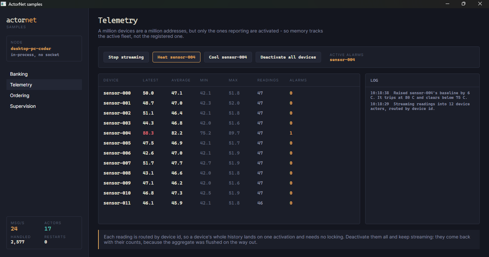

# Streams

*Dibuat oleh Gravicode Studios, dipimpin oleh Kang Fadhil.*
*[Bahasa Indonesia](../id/07-streams.md) · [Docs index](README.md)*

## Scope, stated honestly

`ActorStream` is `IAsyncEnumerable<T>` with a few operators and an actor sink. It is **not** a port
of Akka Streams: there is no graph DSL, no materialisation, no dynamic fan-in.

That is the scope that earns its place. It covers "pull from a source, shape it, route each item to
the actor that owns it", which is what event-driven pipelines actually need here, and it composes
with every other async enumerable in .NET instead of inventing a parallel world.

## The shape

```csharp
await ActorStream.From(readings)
    .Where(r => r.Celsius > -50)
    .Select(r => r with { Celsius = r.Celsius + calibration })
    .Batch(200, within: TimeSpan.FromSeconds(1))
    .ToActorsAsync(system, batch => ActorId.For<DeviceActor>(batch[0].DeviceId));
```

## Operators

| | |
| --- | --- |
| `Where(predicate)` | Keep matching items |
| `Select(selector)` | Project |
| `SelectAsync(selector)` | Project asynchronously, one at a time, order preserved |
| `Take(count)` | Stop after N |
| `Batch(size, within)` | Group into batches, flushing early on a deadline |
| `Buffer(capacity)` | Decouple producer and consumer with a bounded queue |
| `Tap(effect)` | Side effect per item, passing it through |

### Why `Batch` takes a time bound

A size-only batcher leaves a partly-filled batch sitting forever on a quiet stream. `within` is
what stops the last 37 readings of the day from never being delivered. The check runs per item
rather than on a timer — a timer would need a second thread and a lock over the list, and this is
enough for a stream that is producing at all.

## Sinks

```csharp
// Route by key: each item lands on the activation that owns it.
await stream.ToActorsAsync(system, item => ActorId.For<DeviceActor>(item.DeviceId));

// Everything to one actor.
await stream.ToActorAsync(system, ActorId.For<AlarmDeskActor>("main"));

// Just run it.
var count = await stream.RunAsync(async (item, ct) => await Handle(item, ct));
```

`ToActorsAsync` is where a stream meets the actor model. Routing by key means every item for a key
lands on that key's single activation, so **per-key ordering and single-writer state come for
free** — no partitioning scheme, no locks, no coordinating consumer group.

## Backpressure

There is no separate backpressure protocol. The stream pulls, so the consumer's pace is the
producer's pace.

Where that matters:

- **Unbounded mailboxes (the default) give no backpressure.** `ToActorsAsync` will happily fill
  memory if the actors cannot keep up.
- **A bounded mailbox propagates.** Set `options.MailboxCapacity` and a send stops completing
  synchronously once the actor falls behind, which pushes the slowdown back through the stream to
  the source.
- **`Buffer(n)` absorbs a burst**, not a sustained mismatch. It is a shock absorber, not a fix.

If a stream is feeding actors from an external firehose, bound the mailbox. That is the one setting
that turns "slow consumer" from an out-of-memory into a slowdown.

## Failures

A producer failure propagates to the consumer, including through `Buffer`:

```csharp
await Assert.ThrowsAsync<InvalidOperationException>(async () =>
    await ActorStream.From(Failing()).Buffer(4).RunAsync());
```

A buffered stream that swallowed the producer's exception would look like a stream that simply
ended, and the caller would never learn it lost data.

The sink side is different: `ToActorsAsync` uses `TellAsync`, so a failure *inside* an actor is the
actor's supervisor's problem, not the stream's. The stream sees a successful send. If you need the
stream to know, use an ask in `RunAsync` instead.

## Interop

```csharp
IAsyncEnumerable<T> raw = stream.AsAsyncEnumerable();   // out
ActorStream.From(channel.Reader.ReadAllAsync());        // in
ActorStream.From(File.ReadLinesAsync(path));
ActorStream.Interval(TimeSpan.FromSeconds(1), tick => new Heartbeat(tick));
```

Anything producing an `IAsyncEnumerable` is a source — a channel, a file, an EF Core query, a Kafka
consumer wrapper.

## A worked example

The telemetry sample, in full:

```csharp
await ActorStream
    .Interval(TimeSpan.FromMilliseconds(30), tick => tick)
    .Select(tick =>
    {
        var device = (int)(tick % deviceCount);
        return new SensorReading($"sensor-{device:D3}", ReadTemperature(device), DateTimeOffset.UtcNow);
    })
    .ToActorsAsync(system, reading => ActorId.For<DeviceActor>(reading.DeviceId), cancellationToken);
```

Each device actor keeps a rolling aggregate with no locking, raises an alarm to a single desk actor
when it goes over temperature, and is swept when it stops reporting.



## Not built yet

- Merge, split and fan-in operators
- Durable stream positions across a restart

See the [roadmap](../../Plan.md).

## Next

- [Actors and lifecycle](03-actors.md)
- [Performance](10-performance.md)
