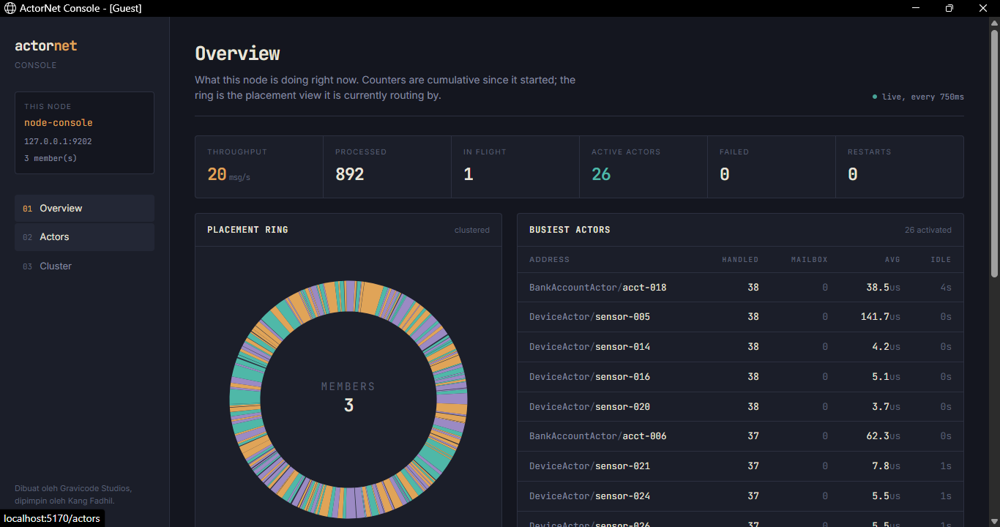
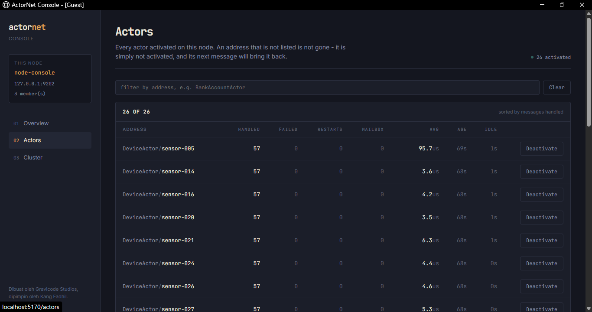
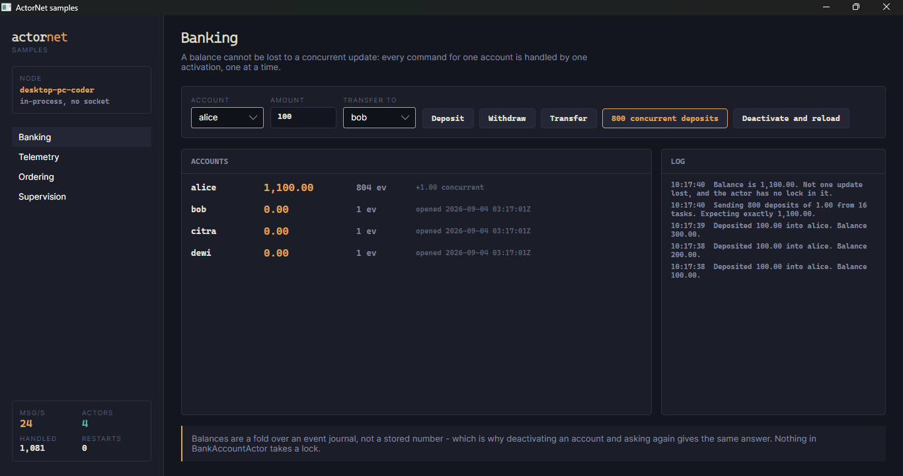
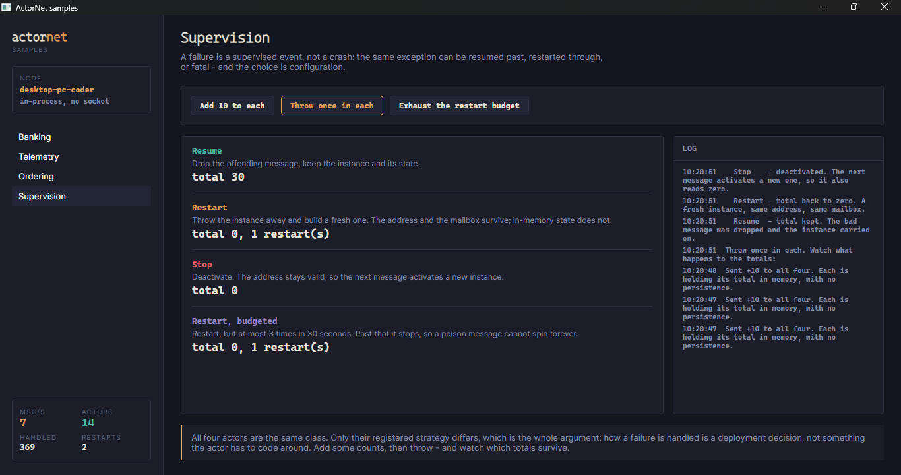

# Tooling

*Dibuat oleh Gravicode Studios, dipimpin oleh Kang Fadhil.*
*[Bahasa Indonesia](../id/09-perkakas.md) · [Docs index](README.md)*

Three surfaces over the same runtime: a terminal CLI, a web console, and desktop samples.

## The CLI

```bash
dotnet tool install -g ActorNet.Cli   # the "actornet" command
```

| Command | |
| --- | --- |
| `run` | Start a node and keep it running |
| `monitor` | Start a node with a live dashboard in the terminal |
| `demo <scenario>` | Run a worked scenario |
| `cluster` | Join a cluster and show membership and key placement |
| `bench` | Measure throughput |
| `scenarios` | List the scenarios and what each demonstrates |

Shared options: `--node-id`, `--host`, `-p|--port`, `--seed` (repeatable), `--cluster`, `--data`,
`--idle-timeout`, `-v|--verbose`.

`--data <dir>` swaps the in-memory stores for file-backed ones, which is what makes "stop it, start
it again, the balance is still there" demonstrable rather than merely claimed.

Set `ACTORNET_DEBUG=1` for full stack traces. By default a failure prints one line — a stack trace
is the right thing for a framework bug and the wrong thing for "port 9000 is already in use", which
is most of what goes wrong.

### Demos

```bash
actornet demo banking      # event-sourced accounts; 200 concurrent deposits, no locks
actornet demo telemetry    # a reactive stream into one actor per device
actornet demo ordering     # a saga that compensates when payment fails
actornet demo lifecycle    # activate, deactivate, reactivate from the journal
actornet demo              # a menu
```

Each prints what it is about to do, does it, and then shows the number that proves it worked.

### Monitor

```bash
actornet monitor --load --refresh 250 --top 20
```

Redraws a fixed layout in place rather than scrolling — a scrolling monitor is unreadable well
below what this runtime does. `--load` generates synthetic traffic so there is something to watch.

### Bench

```bash
actornet bench -n 2000000 -a 8
```

Reports two numbers on purpose:

```
Dispatch only   3,035,763 msg/s  (what a naive benchmark reports)
Drained         2,981,276 msg/s  (every message handled)
```

A tell completes when the message is *accepted* into a mailbox, so timing a loop of tells measures
how fast the process can fill a channel. The drained figure is bounded by an ask barrier per actor,
which is ordered behind everything already queued — its reply proves the queue drained. See
[Performance](10-performance.md).

## The web console

```bash
dotnet run --project src/ActorNet.Dashboard
```

It is itself a node, so the numbers are the runtime's own counters rather than a scrape.

```bash
dotnet run --project src/ActorNet.Dashboard -- \
  --ActorNet:NodeId=console-1 \
  --ActorNet:Port=9100 \
  --ActorNet:Seeds:0=127.0.0.1:9000
```

Set `ActorNet:GenerateLoad=false` to watch a real workload instead of a synthetic one.

### Overview



Throughput, messages handled, in flight, active actors, failures, restarts — and the busiest
actors, since on a node with thousands the interesting ones are the ones doing work.

**In flight** counts messages accepted for handling *on this node*. A message forwarded to the node
that owns its key is not in flight here. Getting that wrong made the console read 3,524 in flight
against 26 active actors, which is what caught the bug.

### Actors



Every activation on this node, filterable, with a **Deactivate** button.

Deactivating is not destructive: it runs the deactivation hook, where a persistent actor flushes,
and removes the actor from this node. The address stays valid and the next message activates a
fresh instance from the store — the same thing the idle sweeper does.

### Cluster


The member table, and the ring drawn as it actually is: one arc per span of hash space, coloured by
its owning node. The stripes are the virtual nodes, and their interleaving is why adding a member
moves roughly 1/N of the keyspace.

Type an address into the probe and a marker lands on the arc that owns it — the same computation
the runtime does on every send.

### HTTP API

```bash
curl localhost:5170/api/metrics
curl localhost:5170/api/cluster
curl localhost:5170/api/deadletters
```

Read-only, so the same numbers are available to a scrape or a script without screen-scraping.

## The desktop samples

```bash
dotnet run --project samples/ActorNet.Samples.Avalonia
```

Four scenarios over one shared node, started once and kept for the life of the window. Each states
the property of the actor model it demonstrates, and then proves it.

**Banking** — 800 concurrent deposits from 16 tasks into one account. The sample states the
expected balance *before* running, which is the only way an assertion like that means anything.



**Telemetry** — a live stream into one actor per device, with an over-temperature device to
exercise the alarm path. "Deactivate all devices" and keep streaming: they come back with their
counts intact.

**Ordering** — a saga across inventory and payment. Set the credit limit below an order's total and
the saga fails at payment *after* stock was reserved; watch the held count go back up. "Try to
oversell" fires more single-unit orders than there is stock and the number never goes negative.

**Supervision** — four actors of the same class, registered with different strategies, given the
same exception.



## Benchmarks

```bash
dotnet run -c Release --project benchmarks/ActorNet.Benchmarks
dotnet run -c Release --project benchmarks/ActorNet.Benchmarks -- --filter '*RoutingBenchmarks*'
```

BenchmarkDotNet, with memory diagnostics. `MessagingBenchmarks` covers the message path;
`RoutingBenchmarks` covers hashing, placement and serialization.

## Dead letters

An undeliverable message is recorded rather than logged and dropped. Logging alone makes it
invisible to everything except a human reading logs.

```csharp
foreach (var letter in system.DeadLetters.Recent(20))
    Console.WriteLine($"{letter.Target} {letter.MessageType}: {letter.Reason} - {letter.Detail}");

system.DeadLetters.LetterRecorded += letter => alerting.Raise(letter);
```

| Reason | |
| --- | --- |
| `UnregisteredActorType` | The address named a type this node never registered |
| `UndeliverableToActor` | The actor kept deactivating between lookup and delivery |
| `NodeUnreachable` | The node owning the key could not be reached |
| `UnknownMessageType` | A frame named an alias the allow-list refuses |
| `UnroutableFrame` | A malformed address, or a frame with no payload |
| `Shutdown` | The node was stopping |

The message object is kept where it was materialized, so a letter can be re-driven once whatever was
broken is fixed. It is deliberately **absent** for a frame refused before deserialization -
materializing a payload the allow-list just refused would undo the refusal.

The buffer is bounded and drops the oldest; `Count` is still the exact lifetime total. A node that is
failing to deliver is usually failing a lot, and an unbounded record of that is a second outage on
top of the first. Swap it with `options.DeadLetters`.

## Exporting to OpenTelemetry

The console reads the runtime's own counters, which is fine for one node and useless for anything
that aggregates. The standard .NET primitives are exposed for that:

```csharp
builder.Services.AddOpenTelemetry()
    .WithTracing(t => t.AddSource(ActorNetDiagnostics.ActivitySourceName))
    .WithMetrics(m => m.AddMeter(ActorNetDiagnostics.MeterName));
```

ActorNet takes no dependency on OpenTelemetry to provide these - they are an `ActivitySource` and a
`Meter`, so any collector picks them up.

| Instrument | |
| --- | --- |
| `actornet.messages.processed` | Messages handled, by actor type |
| `actornet.messages.failed` | Handlers that threw, by actor type and exception |
| `actornet.actors.activated` / `.deactivated` / `.restarted` | Lifecycle, deactivations tagged with the reason |
| `actornet.deadletters` | Undelivered, tagged with the reason |
| `actornet.message.duration` | Time in the handler |
| `actornet.message.queue_time` | Time waiting in a mailbox |

Of the two histograms, **queue time is the one to watch**. Handler time says how expensive the work
is; queue time says whether the node is keeping up with it.

Each handled message also produces a span, `"<ActorType> receive"`, of kind `Consumer` - so a trace
viewer draws it as the receiving half of a send. A handler that throws marks its span as an error and
attaches the exception.

None of this costs anything when nothing is listening: `StartActivity` returns null without a
listener, and an instrument with no collector does not record. That is what makes tracing affordable
on the per-message path.

## Next

- [Performance](10-performance.md)
- [Troubleshooting](11-troubleshooting.md)
