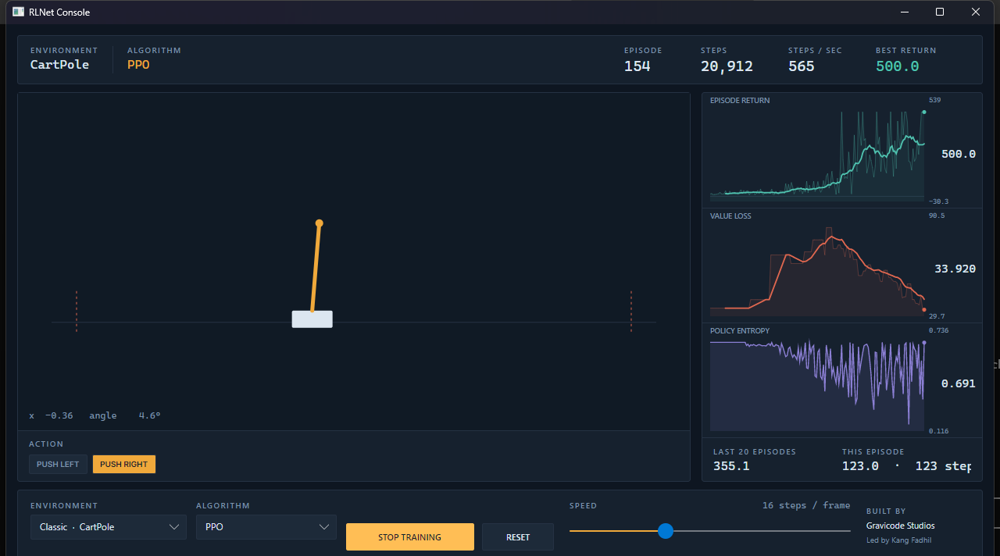
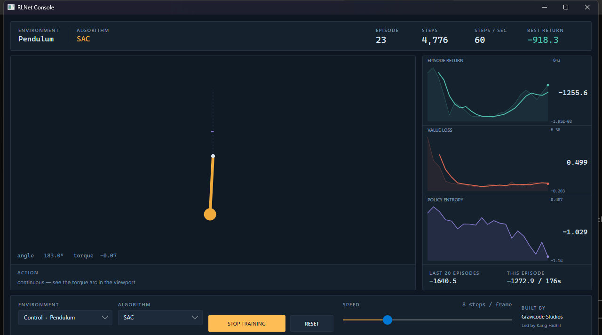
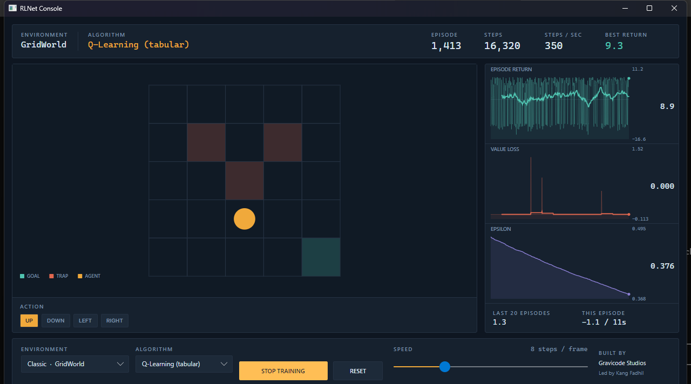
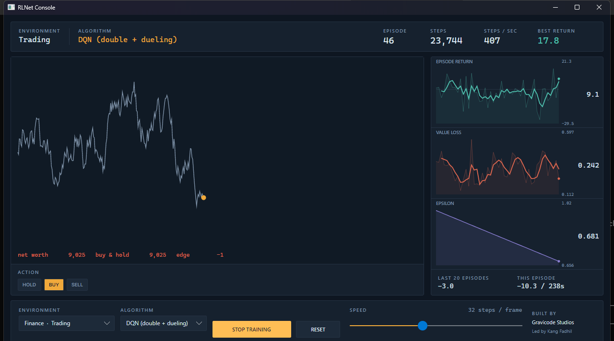

# RLNet

**Reinforcement learning for .NET 10 — no Python, no native dependencies, one NuGet package.**

*Dibuat oleh Gravicode Studios, dipimpin oleh Kang Fadhil.*
*Created by Gravicode Studios, led by Kang Fadhil.*

[Bahasa Indonesia ↓](#rlnet-bahasa-indonesia) · [Documentation](docs/en/README.md) · [Dokumentasi](docs/id/README.md)

---

RLNet is a complete reinforcement-learning library written from scratch in C#. It ships six
algorithms, nine environments, a SIMD neural-network engine, and a desktop console for watching an
agent learn — with no dependency on PyTorch, no native binaries, and no Python in the loop.

```csharp
using RLNet;
using RLNet.Training;

var environment = Catalog.CreateDiscrete("CartPole");
var agent = Catalog.CreateAgent(Algorithm.Ppo, environment.ObservationSpace, environment.ActionSpace, seed: 1);

var report = Trainer.Train(environment, agent, new TrainingOptions
{
    MaxSteps = 150_000,
    SolveThreshold = 475,   // CartPole's conventional bar
    Seed = 1,
});

Console.WriteLine(report);
Console.WriteLine(Trainer.Evaluate(environment, agent, episodes: 20));
```

```
333 episodes, 61,306 steps in 11.2s (5,494 steps/s), final average return 475.54, solved at episode 333
500
```

That is a real run on a laptop CPU, seeded so you get the same one. It stopped early because it hit
the solve threshold, and a deterministic evaluation of the finished policy scores a perfect 500.

## What is in it

| | |
|---|---|
| **Algorithms** | DQN (double + dueling + prioritised replay), PPO, A2C, SAC, TD3, tabular Q-learning |
| **Environments** | CartPole, MountainCar, GridWorld, LunarLander, Pendulum, Reacher, Trading, SupplyChain, PredatorPrey |
| **Engine** | Dense MLP with Adam, vectorised through `Vector<T>` — AVX-512, AVX2 and NEON from one implementation |
| **Multi-agent** | Simultaneous-move environments with independent or parameter-shared learners |
| **Optional GPU** | `RLNet.Gpu` runs the dense kernels on CUDA or OpenCL via ILGPU, and falls back to CPU on its own |
| **Console** | Avalonia desktop app — Windows, Linux, macOS |

## Install

```bash
dotnet add package RLNet
dotnet add package RLNet.Gpu   # optional, only for wide networks
```

Requires the .NET 10 SDK.

## The console

```bash
dotnet run --project src/RLNet.Visualizer

# or open straight onto something specific
dotnet run --project src/RLNet.Visualizer -- --env Pendulum --algo Sac --start
```



Pick an environment and an algorithm, press **Start training**, and watch. The viewport shows what
the agent is doing; the recorder stack beside it shows whether it is working — episode return,
value loss and exploration on one shared axis, so the relationship between them is visible at a
glance. Every session runs from the same seed, so switching algorithm and switching back replays
the same run.

<table>
<tr>
<td width="50%"><br><sub><b>Pendulum / SAC</b> — the violet arc is the applied torque. The third trace relabels itself to policy entropy for policy-gradient agents.</sub></td>
<td width="50%"><br><sub><b>PredatorPrey / DQN</b> — three predators on a wrapping grid. A capture needs two of them on the prey at once, so it cannot be solved alone.</sub></td>
</tr>
<tr>
<td width="50%"><br><sub><b>GridWorld / Q-Learning</b> — best return 9.3, which is exactly optimal. The environment to debug against.</sub></td>
<td width="50%"><br><sub><b>Trading / DQN</b> — a mean-reverting series with buy-and-hold shown alongside, because beating it is the only result that means anything.</sub></td>
</tr>
</table>

## Design decisions worth knowing

**Termination and truncation are different things.** An episode that reaches a real terminal state
and one cut off by a step limit need different bootstrap targets, and conflating them is the most
common silent bug in hand-rolled RL. `StepResult` carries both flags separately and every agent
reads `Terminated` — never `Done` — when it forms a target.

**Observations are spans over environment-owned memory.** A training run makes millions of steps;
returning a fresh array from each one is the difference between a quiet heap and a garbage
collector running flat out. The contract is strict: **the span is invalidated by the next step**,
so anything that must outlive the step copies it. The library does this for you everywhere it
matters.

**No PyTorch, on purpose.** TorchSharp would bring autograd and CUDA, and a large native dependency
per platform with it. For the network sizes classic control needs — two or three layers of 64 to
256 units — a SIMD CPU implementation is not the compromise it sounds like. A full
forward-backward-update cycle allocates zero bytes. Where GPU genuinely pays off — wide networks,
large batches — `RLNet.Gpu` is there, and [measuring the crossover on your own hardware](docs/en/06-gpu.md)
is a one-command job.

**The seams are real.** Replay buffers, compute backends and encoders are interfaces the agents
take rather than construct, so swapping uniform for prioritised replay — or plugging in your own —
is a constructor argument, not a fork.

**Gym-shaped, not Gym-compatible.** The environment contract mirrors `gymnasium`'s design, so agents
and hyper-parameters transfer conceptually — but there is no interop layer, and Atari and MuJoCo are
out of scope. CartPole, MountainCar and Pendulum match Gymnasium's constants exactly and are directly
comparable; LunarLander and Reacher are lighter analytic stand-ins and are not.
[The full scope note](docs/en/README.md#scope-and-what-is-deliberately-outside-it) says which is which.

## Documentation

Full documentation in [English](docs/en/README.md) and [Bahasa Indonesia](docs/id/README.md):
getting started, architecture, the algorithms, the environments, the neural engine, GPU, the
console, benchmarks, and how to extend any of it.

## Building from source

```bash
dotnet build RLNet.slnx -c Release
dotnet run --project tests/RLNet.Tests -c Release          # 88 tests
dotnet run -c Release --project benchmarks/RLNet.Benchmarks
```

> `dotnet test` does not work on the .NET 10 SDK for this project — the SDK dropped the VSTest
> bridge that xunit.v3's test platform needs. Run the test project directly, as above.

## Licence

MIT. See [LICENSE](LICENSE).

---

<a name="rlnet-bahasa-indonesia"></a>

# RLNet (Bahasa Indonesia)

**Reinforcement learning untuk .NET 10 — tanpa Python, tanpa dependensi native, satu paket NuGet.**

*Dibuat oleh Gravicode Studios, dipimpin oleh Kang Fadhil.*

RLNet adalah library reinforcement learning lengkap yang ditulis dari nol dengan C#. Berisi enam
algoritma, sembilan simulasi, mesin neural network ber-SIMD, dan aplikasi desktop untuk menonton
agen belajar — tanpa bergantung pada PyTorch, tanpa binary native, dan tanpa Python.

```csharp
using RLNet;
using RLNet.Training;

var environment = Catalog.CreateDiscrete("CartPole");
var agent = Catalog.CreateAgent(Algorithm.Ppo, environment.ObservationSpace, environment.ActionSpace, seed: 1);

var report = Trainer.Train(environment, agent, new TrainingOptions
{
    MaxSteps = 150_000,
    SolveThreshold = 475,   // batas "selesai" konvensional untuk CartPole
    Seed = 1,
});

Console.WriteLine(report);
Console.WriteLine(Trainer.Evaluate(environment, agent, episodes: 20));
```

```
333 episodes, 61,306 steps in 11.2s (5,494 steps/s), final average return 475.54, solved at episode 333
500
```

Itu run sungguhan di CPU laptop, ber-seed sehingga hasilnya sama jika Anda jalankan. Run berhenti
lebih awal karena sudah melewati ambang "selesai", dan evaluasi deterministik atas policy akhirnya
mendapat nilai sempurna 500.

## Isinya

| | |
|---|---|
| **Algoritma** | DQN (double + dueling + prioritised replay), PPO, A2C, SAC, TD3, Q-learning tabular |
| **Simulasi** | CartPole, MountainCar, GridWorld, LunarLander, Pendulum, Reacher, Trading, SupplyChain, PredatorPrey |
| **Mesin** | MLP dense dengan Adam, divektorkan lewat `Vector<T>` — AVX-512, AVX2, dan NEON dari satu implementasi |
| **Multi-agent** | Simulasi gerak-serentak dengan learner independen atau berbagi parameter |
| **GPU opsional** | `RLNet.Gpu` menjalankan kernel dense di CUDA atau OpenCL lewat ILGPU, dan otomatis kembali ke CPU |
| **Konsol** | Aplikasi desktop Avalonia — Windows, Linux, macOS |

## Instalasi

```bash
dotnet add package RLNet
dotnet add package RLNet.Gpu   # opsional, hanya untuk jaringan lebar
```

Butuh .NET 10 SDK.

## Konsol

```bash
dotnet run --project src/RLNet.Visualizer

# atau langsung membuka simulasi tertentu
dotnet run --project src/RLNet.Visualizer -- --env Pendulum --algo Sac --start
```


Pilih simulasi dan algoritma, tekan **Start training**, lalu perhatikan. Viewport menampilkan apa
yang sedang dilakukan agen; tumpukan perekam di sebelahnya menampilkan apakah agen benar-benar
belajar — return per episode, value loss, dan eksplorasi pada satu sumbu yang sama, sehingga
hubungan ketiganya langsung terlihat. Setiap sesi memakai seed yang sama, jadi berganti algoritma
lalu kembali akan memutar ulang run yang persis sama.

<table>
<tr>
<td width="50%"><br><sub><b>Pendulum / SAC</b> — busur ungu adalah torsi yang diberikan. Trace ketiga otomatis berganti label menjadi policy entropy untuk agen policy-gradient.</sub></td>
<td width="50%"><br><sub><b>PredatorPrey / DQN</b> — tiga predator di grid yang menyambung di tepinya. Menangkap mangsa butuh dua predator sekaligus, jadi mustahil diselesaikan sendirian.</sub></td>
</tr>
<tr>
<td width="50%"><br><sub><b>GridWorld / Q-Learning</b> — return terbaik 9.3, tepat optimal. Simulasi untuk mengecek kalau ada yang salah.</sub></td>
<td width="50%"><br><sub><b>Trading / DQN</b> — deret harga mean-reverting dengan buy-and-hold ditampilkan berdampingan, karena mengalahkannya adalah satu-satunya hasil yang bermakna.</sub></td>
</tr>
</table>

## Keputusan desain yang perlu diketahui

**Termination dan truncation itu berbeda.** Episode yang mencapai kondisi akhir sungguhan dan
episode yang dipotong batas langkah membutuhkan target bootstrap yang berbeda, dan menyamakan
keduanya adalah bug diam-diam paling umum pada kode RL buatan sendiri. `StepResult` membawa kedua
flag secara terpisah, dan setiap agen membaca `Terminated` — bukan `Done` — saat menyusun target.

**Observasi berupa span di atas memori milik environment.** Satu run training menjalankan jutaan
langkah; mengembalikan array baru pada setiap langkah adalah beda antara heap yang tenang dan
garbage collector yang bekerja tanpa henti. Kontraknya tegas: **span menjadi tidak valid pada
langkah berikutnya**, jadi apa pun yang harus bertahan lebih lama disalin dulu. Library sudah
melakukan ini di semua tempat yang penting.

**Sengaja tanpa PyTorch.** TorchSharp membawa autograd dan CUDA, sekaligus dependensi native yang
besar untuk setiap platform. Untuk ukuran jaringan yang dibutuhkan classic control — dua atau tiga
layer berisi 64 sampai 256 unit — implementasi SIMD di CPU bukan kompromi seperti yang terdengar.
Satu siklus penuh forward-backward-update tidak mengalokasikan memori sama sekali. Jika GPU memang
menguntungkan — jaringan lebar, batch besar — `RLNet.Gpu` tersedia, dan
[mengukur titik impasnya di perangkat Anda sendiri](docs/id/06-gpu.md) cukup satu perintah.

**Sambungannya nyata.** Replay buffer, compute backend, dan encoder adalah interface yang diterima
agen lewat konstruktor, bukan yang dibuat sendiri di dalamnya — jadi mengganti uniform replay
dengan prioritised, atau memasang buatan sendiri, cukup satu argumen konstruktor.

**Berbentuk seperti Gym, bukan kompatibel dengan Gym.** Kontrak environment-nya mencerminkan desain
`gymnasium`, sehingga agen dan hyper-parameter berpindah secara konseptual — tapi tidak ada lapisan
interop, dan Atari serta MuJoCo di luar cakupan. CartPole, MountainCar, dan Pendulum sama persis
dengan konstanta Gymnasium dan langsung sebanding; LunarLander dan Reacher adalah pengganti analitik
yang lebih ringan dan tidak sebanding.
[Catatan cakupan lengkapnya](docs/id/README.md#cakupan-dan-apa-yang-sengaja-di-luarnya) menjelaskan
mana yang mana.

## Dokumentasi

Dokumentasi lengkap dalam [Bahasa Indonesia](docs/id/README.md) dan [English](docs/en/README.md):
memulai, arsitektur, algoritma, simulasi, mesin neural, GPU, konsol, benchmark, dan cara
memperluas semuanya.

## Build dari sumber

```bash
dotnet build RLNet.slnx -c Release
dotnet run --project tests/RLNet.Tests -c Release          # 88 tes
dotnet run -c Release --project benchmarks/RLNet.Benchmarks
```

> `dotnet test` tidak berfungsi di .NET 10 SDK untuk proyek ini — SDK menghapus jembatan VSTest
> yang dibutuhkan test platform xunit.v3. Jalankan project tesnya langsung seperti di atas.

## Lisensi

MIT. Lihat [LICENSE](LICENSE).
