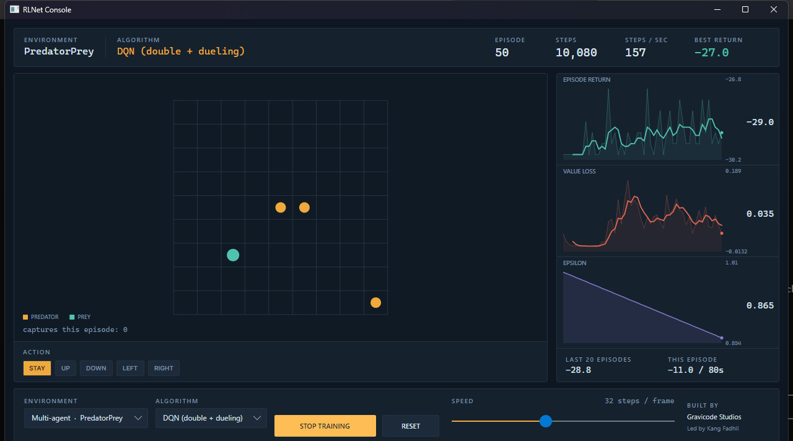

# Multi-agent

[← Daftar isi](README.md) · [English](../en/07-multi-agent.md)



## Kontraknya

```csharp
public interface IMultiAgentEnvironment
{
    int AgentCount { get; }
    Space ObservationSpace { get; }
    DiscreteSpace ActionSpace { get; }

    ReadOnlySpan<float> ObservationOf(int agent);
    ReadOnlySpan<float> LastRewards { get; }

    void Reset(int? seed = null);
    MultiAgentStepResult Step(ReadOnlySpan<int> actions);
}
```

Gerak serentak dan sepenuhnya sinkron: setiap agen mengirimkan aksi, dunia maju satu langkah,
semuanya menerima reward. Permainan bergiliran butuh kontrak berbeda dan di luar cakupan.

**Setiap agen punya observasi terpisah**, karena keterbatasan pengamatan adalah bagian menarik dari
setting multi-agent. Predator yang bisa melihat seluruh papan sedang menyelesaikan masalah yang
berbeda dan jauh lebih mudah daripada yang hanya melihat sekitarnya.

Reward diekspos lewat `LastRewards` alih-alih dibawa di hasil langkah, sehingga membacanya tidak
mengalokasikan apa pun pada langkah yang terjadi jutaan kali.

## Yang tidak dijanjikan: stasioneritas

Setiap hasil konvergensi single-agent mengasumsikan environment yang stasioner. Di sini
environment-nya *berisi pembelajar lain*.

```
    Dari sudut pandang agen 1:
    ┌──────────────────────────────────────────────┐
    │  "environment"                               │
    │  ┌────────────┐  ┌──────────┐  ┌──────────┐  │
    │  │   dunia    │  │ agen 2   │  │ agen 3   │  │
    │  │            │  │(belajar) │  │(belajar) │  │
    │  └────────────┘  └──────────┘  └──────────┘  │
    └──────────────────────────────────────────────┘
                            ▲
            keduanya berubah seiring berjalannya training,
            jadi dinamika transisi agen 1 bergeser di bawahnya
```

Dalam praktik itu muncul sebagai kurva pembelajaran yang lebih berisik dan sesekali "lupanya"
perilaku yang tadinya sudah berhasil. Pengalaman yang di-replay adalah kasus paling tajam: transisi
lama menggambarkan dunia yang sudah tidak ada, karena agen lain sudah membaik sejak itu.

Pelatihan tersentralisasi dengan eksekusi terdesentralisasi — MADDPG, QMIX — ada untuk mengatasi ini
dan berada di luar cakupan. `IndependentLearners` sengaja mengabaikan masalah ini, dan halaman inilah
tempat hal itu didokumentasikan.

## Learner independen

Baseline yang dijadikan pembanding oleh setiap makalah multi-agent (Tan, 1993): setiap agen
memperlakukan yang lain sebagai bagian environment dan belajar seolah-olah sendirian.

```csharp
var environment = new PredatorPreyEnvironment(gridSize: 9, predatorCount: 3);

var agents = Enumerable.Range(0, environment.AgentCount)
    .Select(i => (IDiscreteAgent)new DqnAgent(
        environment.ObservationSpace, environment.ActionSpace, seed: i))
    .ToList();

var learners = new IndependentLearners(agents, environment.ObservationSpace.FlatSize);
var report = Trainer.Train(environment, learners, new TrainingOptions { MaxEpisodes = 2_000 });
```

Setiap agen punya jaringannya sendiri, replay buffernya sendiri, jadwal eksplorasinya sendiri.
Mereka boleh algoritma berbeda — tidak ada yang mengharuskan sama — dan begitulah cara menyiapkan
perbandingan kompetitif.

## Parameter bersama

Untuk agen yang **homogen**, satu policy yang dipakai bersama biasanya jawaban yang lebih baik:

```csharp
var shared = new DqnAgent(environment.ObservationSpace, environment.ActionSpace, seed: 1);
var learners = IndependentLearners.ShareParameters(
    shared, environment.AgentCount, environment.ObservationSpace.FlatSize);
```

Dua keuntungan, keduanya besar:

- **Pengalaman terkumpul.** Tiga predator menghasilkan tiga transisi per langkah ke satu buffer,
  jadi policy-nya melihat tiga kali lipat data per detik nyata.
- **Sebagian besar non-stasioneritasnya hilang.** Hanya ada satu policy, jadi agen tidak bisa
  saling menjauh — hanya dunianya yang berubah di bawah mereka.

Biayanya: setiap agen berperilaku identik. Untuk predator itu tidak masalah, bahkan bisa dibilang
benar. Untuk agen dengan peran yang sungguh-sungguh berbeda, itu keliru.

Inilah yang dipakai konsol, dan itulah sebabnya PredatorPrey menunjukkan kemajuan di sana dalam
hitungan menit.

`IndependentLearners` mendeteksi ketika instance yang sama mengisi semua slot dan memanggil
`OnEpisodeEnd` serta `SetProgress` **sekali** alih-alih per agen — kalau tidak, sebuah jadwal akan
meluruh N kali lebih cepat daripada yang dibenarkan oleh jumlah episodenya.

## PredatorPrey

Tiga predator menyudutkan mangsa yang kabur di grid 9×9 yang menyambung.

**Penangkapan mengharuskan dua predator di sel mangsa pada saat yang sama.** Predator yang hanya
mengejar tidak pernah mencetak angka. Reward-nya dibagi, perilaku yang menghasilkannya harus
terkoordinasi — itulah seluruh alasan simulasi ini ada di sini.

Pilihan desain yang penting:

| Pilihan | Alasannya |
|---|---|
| Grid-nya menyambung | Pada grid berbatas, predator menggiring mangsa ke pojok dan tugasnya runtuh. Pada torus tidak ada tempat menyudutkan, jadi pengepungan sungguhan satu-satunya strategi. |
| Jendela lokal 5×5 plus arah | State penuh akan membuat tiap predator bisa menghitung rencana bersama sendirian. Arahnya mencegah predator yang kehilangan jejak berkeliaran, yang akan membuat penugasan kredit terlalu jarang. |
| Penangkapan membayar **semua** predator | Membayar hanya penghuninya berarti memberi imbalan kepada yang datang terakhir dan tidak mengajarkan apa pun kepada yang lain tentang manuver yang menyiapkannya. |
| Berdiri sendirian di atas mangsa dibayar 0,5 | Kemajuan layak dorongan, tapi kecil saja — kalau lebih besar, predator belajar duduk menunggu di atas mangsa alih-alih berkoordinasi. |
| Mangsa muncul lagi alih-alih mengakhiri episode | Satu episode jadi bisa mengajarkan beberapa penangkapan, dan return membedakan predator yang beruntung dari yang konsisten. |
| Mangsanya heuristik tetap | Menjaga sinyal training cukup stasioner untuk dibaca; ia kabur dari predator terdekat dengan gerakan acak sesekali agar predator tidak bisa mempelajari lawan yang murni reaktif. |

Tidak ada kondisi akhir — episodenya selalu berjalan sampai batas 200 langkah — jadi return berarti
"penangkapan per episode" dan langsung sebanding antar run.

## Membaca hasilnya

`Trainer` melaporkan **jumlah** seluruh agen. Pada tugas kooperatif dengan reward bersama, itulah
besaran yang dimaksimalkan. Pada tugas kompetitif itu tidak bermakna, dan itu batasan loop ini,
bukan batasan interface environment-nya — untuk kerja kompetitif, lacak sendiri return per agen
lewat `LastRewards`.

Return awal didominasi biaya per langkah, jadi pembelajaran muncul sebagai episode belakangan
mengalahkan episode awal, bukan sebagai kurva yang melewati nol:

```csharp
float awal = report.Returns.Take(30).Average();
float akhir = report.Returns.TakeLast(30).Average();
```

Itu persis yang diperiksa `IndependentLearners_CoordinateOnPredatorPrey`.

## Membuat sendiri

```csharp
public sealed class MyMultiAgentEnvironment : IMultiAgentEnvironment
{
    private readonly float[][] _observations;   // satu per agen
    private readonly float[] _rewards;

    public ReadOnlySpan<float> ObservationOf(int agent) => _observations[agent];
    public ReadOnlySpan<float> LastRewards => _rewards;

    public MultiAgentStepResult Step(ReadOnlySpan<int> actions)
    {
        Array.Clear(_rewards);
        // terapkan setiap aksi, lalu majukan dunia sekali
        WriteObservations();
        return new MultiAgentStepResult(Terminated: false, Truncated: ElapsedSteps >= MaxEpisodeSteps);
    }
}
```

Aturannya sama dengan single-agent: observasi berupa span ke memori yang Anda timpa, dan
`Terminated` berarti kondisi akhir sungguhan, bukan batas langkah. Lihat
[memperluas](10-memperluas.md).

## Selanjutnya

- [Simulasi](04-simulasi.md#predatorprey) — simulasinya secara rinci
- [Konsol](08-konsol.md) — menontonnya
