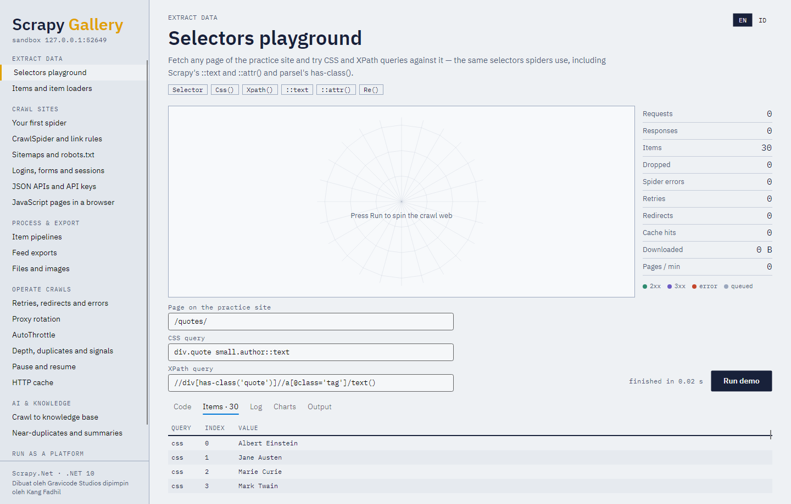

# 4. Selectors, items and item loaders



## Selectors

Every text response exposes `Css`, `Xpath` and `Selector`. The document is parsed once, lazily, with
AngleSharp's HTML5 parser (tolerant of broken markup) or its XML parser for XML responses.

```csharp
response.Css("title::text").Get();                          // text children
response.Css("div.content ::text").GetAll();                // all descendant text (note the space)
response.Css("a.next::attr(href)").Get();                   // attribute value
response.Css("img").Attrib["src"];                          // attributes of the first match
response.Xpath("//h1/text()").Get();
response.Xpath("count(//div[@class='quote'])").Get();       // scalars come back as strings: "10"
response.Xpath("//li[has-class('active')]").GetAll();       // parsel's has-class()
response.Xpath("//a[re:test(@href, '\\.pdf$')]/@href").GetAll();   // EXSLT regex
response.Xpath("//li[@data-id=$id]", new Dictionary<string, object> { ["id"] = "42" });
```

Selections chain, and CSS on an element also tests the element itself (as in parsel):

```csharp
foreach (var quote in response.Css("div.quote"))
{
    var text = quote.Css("span.text::text").Get();
    var author = quote.Xpath(".//small[@class='author']/text()").Get();
}
```

| Method | Returns |
|---|---|
| `Get(default)` | First result's serialized value (outer HTML, text, attribute value) or the default |
| `GetAll()` | All values |
| `GetText()` | All text inside, whitespace-normalized (a convenience parsel lacks) |
| `Re(pattern)` / `ReFirst(pattern)` | Regex matches (group named `extract`, else all groups, else whole matches) |
| `Attrib` | Attributes of the first element |
| `Drop()` | Removes the matched nodes from the document |

XML namespaces are ignored by default, so `//url/loc` matches a sitemap without registering its
namespace. Call `selector.RegisterNamespace("g", "http://base.google.com/ns/1.0")` for
namespace-aware XPath.

Standalone selectors: `Selector.FromHtml(html)`, `Selector.FromXml(xml)`.

JSON responses: `((TextResponse)response).Json()` returns a `JsonNode`; `Json<T>()` deserializes.

## Items

Any object can be an item. Pick what fits:

```csharp
// A record or class — typed and idiomatic
public sealed record Product(string Name, decimal Price, string Url);

// An anonymous object — quick
yield return new { Name = name, Price = price };

// A dictionary — dynamic fields
yield return new Dictionary<string, object?> { ["name"] = name };

// ScrapyNet.Item — declared fields (typos throw), with per-field metadata
public sealed class ProductItem() : Item("name", "price", new Field("url") { Serializer = v => v?.ToString()?.ToLowerInvariant() });
```

`ItemAdapter.For(item)` gives uniform access to all of them — field names, `Get`, `Set`,
`AsDictionary()` — using compiled property accessors cached per type. Setting a field matches names
loosely (`file_urls`, `FileUrls` and `fileUrls` are the same) and converts types (`"12.50"` → `decimal`).

## Item loaders

A loader collects values per field through **input processors** and produces the final value with
**output processors**:

```csharp
public sealed class Book
{
    public string? Title { get; set; }
    public decimal Price { get; set; }
    public List<string> Tags { get; set; } = [];
    public string? Url { get; set; }
}

var loader = new ItemLoader<Book>(response);
loader.AddCss(b => b.Title, "h1::text", Transforms.Clean);
loader.AddCss(b => b.Price, "p.price::text", Transforms.Price);       // "£51.77", "Rp 1.250.000", "12,50 €"
loader.AddXpath(b => b.Tags, "//a[@class='tag']/text()");
loader.Field(b => b.Url).Input(new MapCompose(Transforms.UrlJoin));
loader.AddCss(b => b.Url, "a.permalink::attr(href)");
Book book = loader.LoadItem();
```

Processors (`ScrapyNet.Loaders`):

| Processor | Does |
|---|---|
| `Identity` | Returns values unchanged (default input and output) |
| `TakeFirst` | First non-null, non-empty value |
| `Join(separator)` | Joins values into a string |
| `MapCompose(fns...)` | Applies each function to every value, flattening lists and dropping nulls |
| `Compose(fns...)` | Chains functions over the whole list |
| `AbsoluteUrl` | Resolves relative URLs against the response |

Transforms (`Transforms.*`): `Strip`, `Clean`, `RemoveTags`, `DecodeEntities`, `Lower`, `Upper`,
`ToInt`, `ToDecimal`, `ToDouble`, `Price`, `ToDateTime`, `Regex(pattern)`, `Replace(a, b)`,
`Where(pattern)`, `UrlJoin`, and `Str(func)` to adapt any string function.

Assigning a list to a scalar property takes its first element, so typed items rarely need
`TakeFirst`. For dictionaries, set `DefaultOutputProcessor = new TakeFirst()` to get scalars.

Nested loaders scope to a region but fill the same item:

```csharp
var details = loader.NestedCss("table.specs");
details.AddXpath("weight", ".//th[.='Weight']/following-sibling::td/text()");
```
