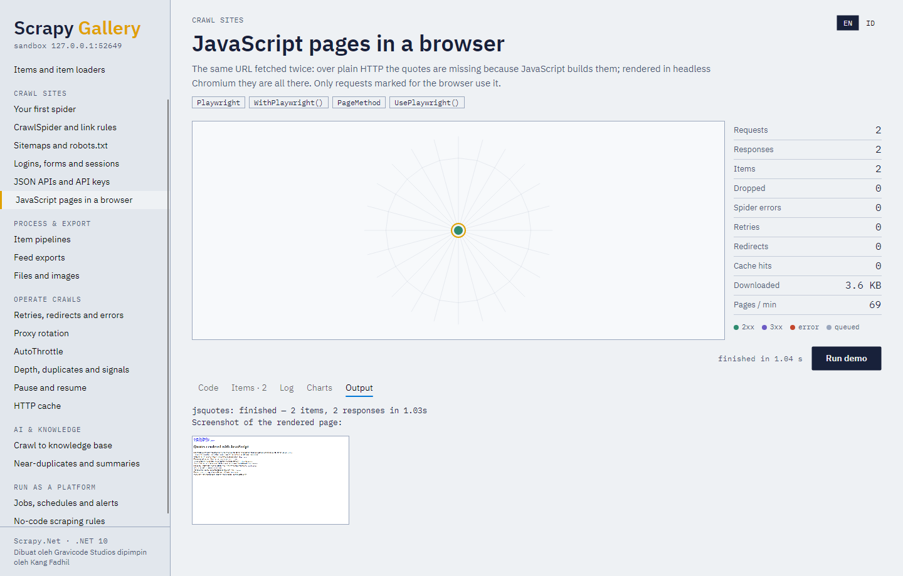

# 9. JavaScript pages



Some pages build their content with JavaScript, so plain HTTP sees an empty shell.
`Gravicode.ScrapyNet.Playwright` renders only the requests you mark, in a headless Chromium, Firefox
or WebKit, and hands your callback the rendered DOM as an ordinary `HtmlResponse`.

```bash
dotnet add package Gravicode.ScrapyNet.Playwright
pwsh bin/Debug/net10.0/playwright.ps1 install chromium     # once per machine
```

or from code: `PlaywrightSetup.InstallBrowsers("chromium");`.

```csharp
using ScrapyNet.Playwright;

settings.UsePlaywright(browser: "chromium", headless: true, maxPages: 8, blockResourceTypes: ["image", "font", "media"]);

public override async IAsyncEnumerable<Request> StartAsync(CancellationToken ct = default)
{
    yield return new Request("https://shop.example/app")
        .WithPlaywright(
            PageMethod.WaitForSelector("div.product"),
            PageMethod.ScrollToBottom(times: 5, pauseMs: 800),   // infinite scroll
            PageMethod.Click("button.load-more"),
            PageMethod.Screenshot());
    await Task.CompletedTask;
}
```

Requests without `.WithPlaywright()` keep using fast plain HTTP through the same handler.

| Page method | Does |
|---|---|
| `WaitForSelector(css, timeoutMs)` | Waits until an element exists |
| `Click(css)`, `Fill(css, value)`, `Press(css, key)` | Interact |
| `Evaluate(js)` | Runs JavaScript; results land in `meta["playwright_evaluate_results"]` |
| `ScrollToBottom(times, pauseMs)` | Triggers lazy loading |
| `WaitForTimeout(ms)`, `WaitForLoadState(state)` | Waits |
| `Screenshot(fullPage)` | PNG bytes in `meta["playwright_screenshot"]` |

Meta keys: `playwright`, `playwright_page_methods`, `playwright_context` (separate cookies/storage
per name), `playwright_wait_until` (`load`, `domcontentloaded`, `networkidle`, `commit`),
`playwright_include_page` (keep the `IPage` in `meta["playwright_page"]`; close it yourself).

Settings: `PLAYWRIGHT_BROWSER_TYPE`, `PLAYWRIGHT_HEADLESS`, `PLAYWRIGHT_MAX_PAGES`,
`PLAYWRIGHT_NAVIGATION_TIMEOUT` (ms), `PLAYWRIGHT_BLOCKED_RESOURCE_TYPES`.

The browser starts lazily with the first rendered request and closes with the spider. Pages are
limited by a semaphore, and blocking images and fonts often halves render time.
