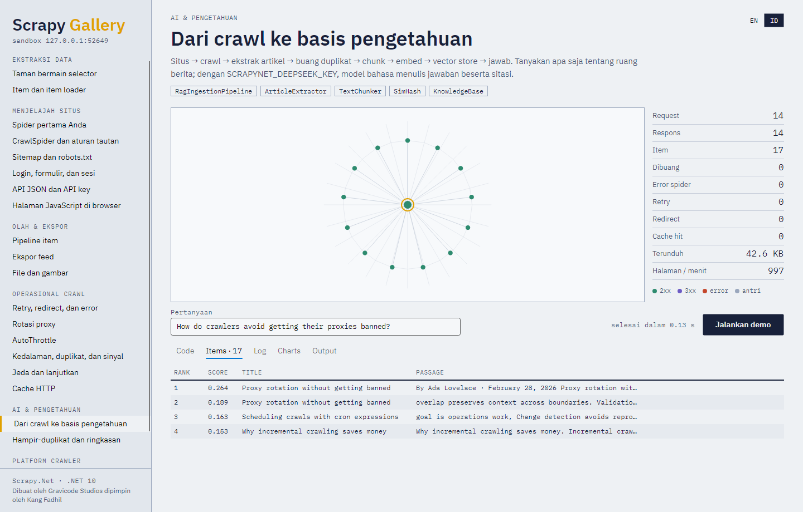

# 10. AI and RAG



`Gravicode.ScrapyNet.AI` turns crawled pages into AI-ready knowledge:

```
Website → Scrapy.Net → clean / normalize → extract the article → dedupe → chunk → embed → vector store → RAG
```

```bash
dotnet add package Gravicode.ScrapyNet.AI
```

## The pipeline in one step

```csharp
using ScrapyNet.AI;

var kb = new KnowledgeBase(new HashingEmbeddingGenerator(512));
settings.ItemPipelines.Add(new RagIngestionPipeline(kb)
{
    Summarizer = new ExtractiveSummarizer(),
    Categorizer = new KeywordCategorizer(new Dictionary<string, string[]>
    {
        ["pricing"] = ["price", "discount", "plan"],
        ["support"] = ["error", "install", "troubleshoot"],
    }),
}, 800);

// Spider items provide "html" (extracted automatically) or "text", plus "url" and "title".
await Scrapy.CrawlAsync(new DocsSpider(), settings);

var hits = await kb.SearchAsync("how do I reset my password?", top: 5);
```

Stats: `rag/documents_seen`, `rag/documents_ingested`, `rag/chunks`, `rag/duplicates`.

## Building blocks

| Class | Does |
|---|---|
| `MetadataExtractor` | Title, description, author, published date, language, canonical URL, OpenGraph, Twitter cards, JSON-LD |
| `ArticleExtractor` | Main content with navigation, sidebars, ads and footers removed (Readability-style scoring) |
| `TextNormalizer` | NFKC, unified quotes and dashes, collapsed whitespace, sentence splitting, tokenizing, stemming |
| `TextChunker` | Paragraph, sentence, fixed-window or Markdown-heading chunking with overlap |
| `ContentHasher` | SHA-256 of normalized text for exact duplicates and change detection |
| `SimHash`, `NearDuplicateIndex` | 64-bit fingerprints; near-duplicate lookup with pigeonhole banding |
| `HashingEmbeddingGenerator` | Local, deterministic embeddings (feature hashing), no model needed |
| `OpenAiEmbeddingGenerator` | Any OpenAI-compatible `/v1/embeddings`: OpenAI, Azure OpenAI, Ollama, LM Studio, vLLM |
| `InMemoryVectorStore` | SIMD cosine search with a bounded heap; save/load to disk |
| `QdrantVectorStore` | Qdrant over REST |
| `OpenAiChatModel` | Any OpenAI-compatible chat endpoint; `ForAzure(...)` for Azure OpenAI |
| `ExtractiveSummarizer` / `LlmSummarizer` | TextRank summaries / model-written summaries |
| `KeywordCategorizer` / `NaiveBayesCategorizer` / `LlmCategorizer` | Rules, trained classifier, zero-shot |
| `ContentChangeStore`, `IncrementalRecrawlMiddleware` | ETag/Last-Modified conditional requests and content-hash change detection |
| `KnowledgeBase` | Ingest, search, and `AskAsync` with cited sources |

## Answers from a language model

```csharp
var model = OpenAiChatModel.ForAzure(endpoint, Environment.GetEnvironmentVariable("AZURE_OPENAI_KEY")!, "gpt-5-mini");
// or: new OpenAiChatModel("deepseek-v4-flash", key, "https://api.deepseek.com/v1/")
// or: new OpenAiChatModel("llama3.1", baseUrl: "http://localhost:11434/v1/")      // Ollama

var kb = new KnowledgeBase(new HashingEmbeddingGenerator()) { LanguageModel = model };
var answer = await kb.AskAsync("What does proxy rotation do when a proxy gets banned?");
Console.WriteLine(answer.Answer);          // "... benched for a cooldown and the request is rerouted [2]."
foreach (var source in answer.Sources) Console.WriteLine(source.Record.Metadata["url"]);
```

Keys belong in environment variables or the platform's `SecretStore`, never in code. Reasoning
models (GPT-5, o-series) reject `temperature` and `max_tokens`; `ForAzure` configures
`max_completion_tokens` and omits temperature for you.

## Semantic embeddings

`HashingEmbeddingGenerator` matches words and word forms, which works well for documentation and
catalogues and costs nothing. For meaning-level search, swap in a real model:

```csharp
var embeddings = new OpenAiEmbeddingGenerator("text-embedding-3-small", 1536, apiKey);
var kb = new KnowledgeBase(embeddings, new QdrantVectorStore("http://localhost:6333", "docs", 1536));
```

## Incremental re-crawls

```csharp
settings.Set("CHANGE_STORE_PATH", "state/changes.json");
settings.DownloaderMiddlewares.Add<IncrementalRecrawlMiddleware>(950);
```

The next run sends `If-None-Match`/`If-Modified-Since`; `304 Not Modified` responses and pages whose
normalized content hash didn't change are skipped (`change_detection/unchanged`), so only new and
changed pages are re-extracted and re-embedded.
