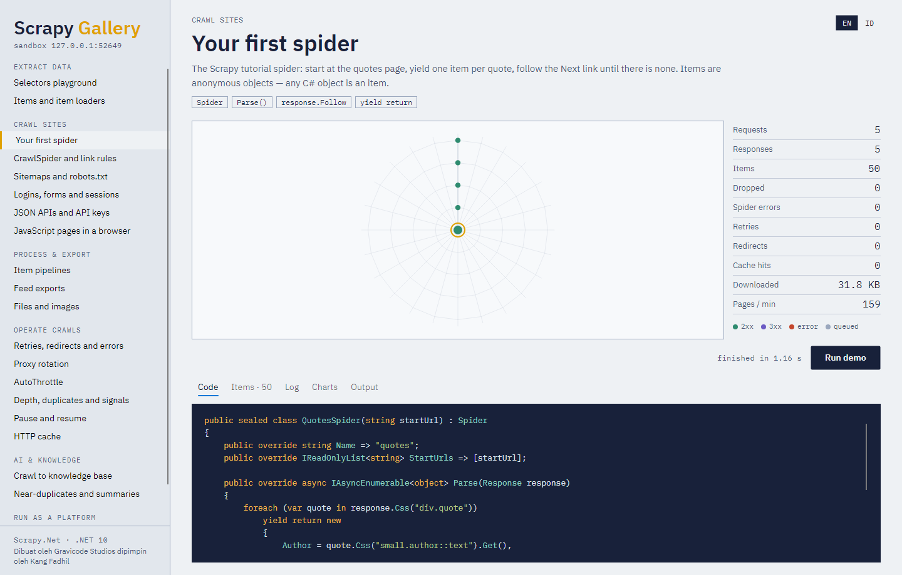
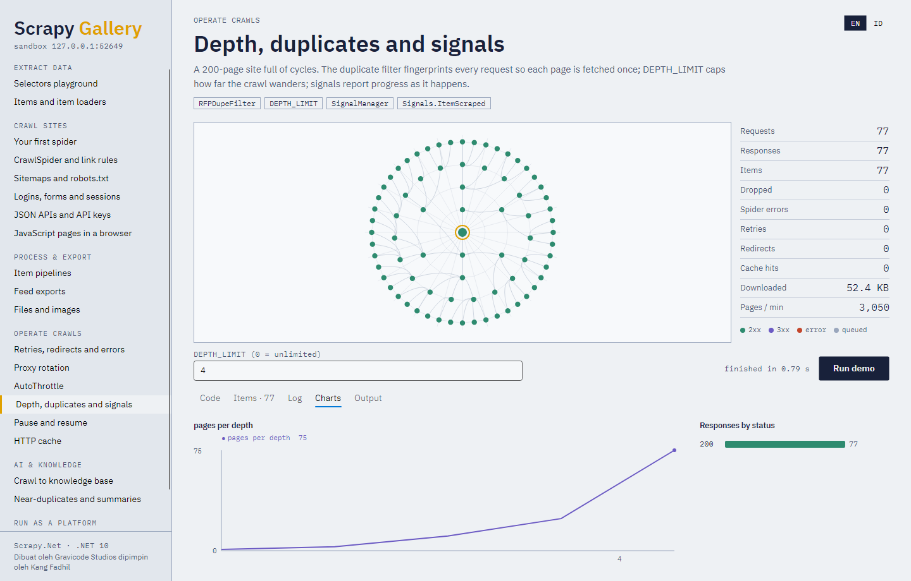
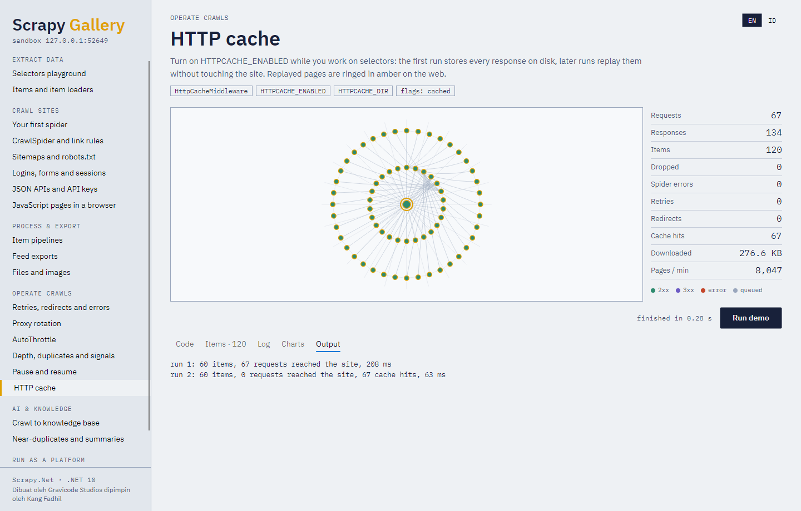

# 12. Gallery, samples and notebooks

## Scrapy Gallery



A desktop app (Avalonia, Windows/Linux/macOS) with every feature as a runnable demo against the
bundled practice site:

```bash
dotnet run --project samples/ScrapyGallery
```

Each demo has a bilingual description (EN/ID toggle), the exact code that runs — the gallery reads it
from its own source files, so what you see is what executes — inputs you can change, and a **Run**
button. While it runs you watch:

- **the crawl web**: the start page at the hub, every followed page spun onto the ring for its link
  depth, a thread back to the page that linked it, coloured by outcome (green 2xx, violet 3xx, rust
  errors, grey queued; amber rings mark cache replays);
- **the ledger**: requests, responses, items, drops, errors, retries, redirects, cache hits, bytes,
  pages per minute;
- tabs for **Items** (a live table), **Log** (Scrapy-style lines), **Charts** (progress, statuses and
  demo-specific series such as AutoThrottle's delay) and **Output** (text, downloaded images,
  browser screenshots).

| Group | Demos |
|---|---|
| Extract data | Selectors playground · Items and item loaders |
| Crawl sites | First spider · CrawlSpider and link rules · Sitemaps and robots.txt · Logins, forms and sessions · JSON APIs and API keys · JavaScript pages in a browser |
| Process & export | Item pipelines · Feed exports · Files and images |
| Operate crawls | Retries, redirects and errors · Proxy rotation · AutoThrottle · Depth, duplicates and signals · Pause and resume · HTTP cache |
| AI & knowledge | Crawl to knowledge base · Near-duplicates and summaries |
| Run as a platform | Jobs, schedules and alerts · No-code scraping rules |




The screenshots in this documentation are produced by the gallery itself, headlessly:

```bash
dotnet run --project samples/ScrapyGallery -- --screenshots docs/images
```

## Console samples

```bash
dotnet run --project samples/ScrapyNet.Samples            # list
dotnet run --project samples/ScrapyNet.Samples -- books   # run one
dotnet run --project samples/ScrapyNet.Samples -- all     # run every offline sample
```

| Sample | Shows |
|---|---|
| `quotes` | Basic spider, pagination, JSON export |
| `books` | CrawlSpider, typed ItemLoader, CSV export |
| `login` | FormRequest with CSRF, cookies |
| `api` | JSON API, per-domain API key, pagination |
| `sitemap` | robots.txt, sitemap index, gzipped sitemaps |
| `feeds` | XmlFeedSpider, CsvFeedSpider |
| `media` | FilesPipeline, ImagesPipeline |
| `pipelines` | Cleaning, validation, dedup, SQLite |
| `middleware` | Custom middleware, random user agents, retries, redirects |
| `proxies` | Proxy rotation with a banned proxy |
| `throttle` | AutoThrottle against a slow server |
| `resume` | JOBDIR pause and resume |
| `cache` | HTTP cache replay |
| `signals` | Signals and the stats dump |
| `rag` | Extraction, chunking, dedup, embeddings, search (LLM answers with `SCRAPYNET_DEEPSEEK_KEY`) |
| `platform` | Declarative spider, jobs, cron, alerts, dashboard |
| `browser` | Playwright rendering and screenshot |
| `toscrape` | The Scrapy tutorial on the real quotes.toscrape.com |

`samples/SingleFile/quotes_spider.cs` is a complete spider in one file (`dotnet run quotes_spider.cs`),
and `samples/ScrapyNet.ServerHost` runs the REST API.

## Notebooks

.NET Interactive notebooks in `notebooks/` (open in VS Code with the Polyglot Notebooks extension):

| Notebook | Covers |
|---|---|
| `01-getting-started` | Fetch, selectors, first spider on quotes.toscrape.com |
| `02-selectors-and-loaders` | Offline selectors and typed item loaders |
| `03-crawlspider-and-exports` | CrawlSpider on books.toscrape.com, CSV/JSONL export |
| `04-sandbox-practice` | Logins, retries and APIs on the in-process practice site |
| `05-ai-rag` | Crawl → knowledge base → search → LLM answer |
| `06-platform-jobs` | Declarative spider, jobs, alerts, cron |

The notebooks are generated from `tools/notebooks/notebooks.mjs`, which also writes a verification
program per notebook; `dotnet run tools/notebooks/verify/05-ai-rag.cs` runs a notebook's code
outside Jupyter.

## The sandbox site

`Gravicode.ScrapyNet.Sandbox` starts a practice website on a free loopback port:

| Path | Content |
|---|---|
| `/quotes/`, `/quotes/page/N/`, `/quotes/tag/T/`, `/quotes/author/A/` | Quotes to scrape (50 quotes, 5 pages) |
| `/quotes/js/` | The same quotes, rendered by JavaScript |
| `/books/`, `/books/catalogue/page-N.html`, product and category pages, `/books/media/N.png` | A bookstore (60 books) with real PNG covers |
| `/news/`, `/news/SLUG` | Articles with boilerplate, OpenGraph and JSON-LD (plus one syndicated near-duplicate) |
| `/news/live` | Content with ETag/Last-Modified; `site.BumpLiveVersion()` changes it |
| `/login`, `/account`, `/logout` | Form login with CSRF token and session cookie (`scrapy` / `net`) |
| `/api/products`, `/api/secure/products`, `/api/quotes` | JSON APIs; the secure one needs `X-Api-Key: sandbox-key` |
| `/robots.txt`, `/sitemap.xml`, `/sitemap-books.xml`, `/sitemap-quotes.xml.gz` | Robots rules, sitemap index, gzipped sitemap |
| `/feeds/products.xml`, `/feeds/products.csv` | Product feeds |
| `/files/`, `/files/report-N.pdf` | Downloadable files |
| `/graph/N` | A 200-page link graph with cycles |
| `/status/CODE`, `/flaky/KEY?fail=N`, `/slow?ms=N`, `/drop`, `/redirect/N`, `/meta-refresh` | Failure modes |
| `/headers`, `/cookies`, `/cookies/set?k=v`, `/ip` | Echo endpoints |

Started with `SandboxOptions { BanProxyAfter = N }` it also acts as an HTTP proxy that starts answering
403 after N requests — the proxy rotation demos use two or three of them.
