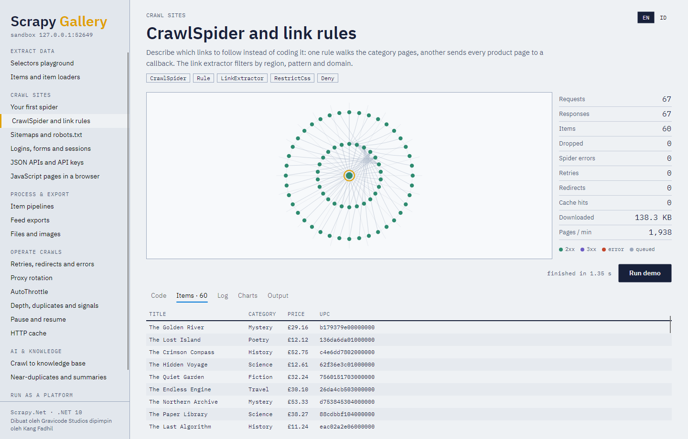

# Scrapy.Net documentation

*Made by Gravicode Studios, led by Kang Fadhil. · [Bahasa Indonesia](../id/README.md)*

Scrapy.Net is a port of [Scrapy](https://scrapy.org/) to .NET 10: the same architecture, the same
component names and setting keys, written as idiomatic C#.

## Chapters

| | |
|---|---|
| [1. Getting started](01-getting-started.md) | Install, first spider, run it, export items |
| [2. Architecture](02-architecture.md) | Engine, scheduler, downloader, scraper, signals — how a request flows |
| [3. Spiders](03-spiders.md) | `Spider`, `CrawlSpider`, `SitemapSpider`, XML/CSV feed spiders, callbacks, errbacks |
| [4. Selectors, items and loaders](04-selectors-items-loaders.md) | CSS/XPath, `::text`, `::attr()`, regex, items, `ItemLoader` |
| [5. Pipelines and feed exports](05-pipelines-and-exports.md) | Cleaning, validation, dedup, databases, files and images, JSON/CSV/XML |
| [6. Settings and middlewares](06-settings-and-middlewares.md) | Settings priorities, every built-in middleware, writing your own |
| [7. Operating crawls](07-operations.md) | Retries, proxies, AutoThrottle, HTTP cache, pause/resume, stats, logging |
| [8. Command line and shell](08-cli-and-shell.md) | `scrapynet` tool, project layout, `crawl`, `shell`, `parse`, single-file spiders |
| [9. JavaScript pages](09-javascript.md) | Playwright rendering, page actions, screenshots |
| [10. AI and RAG](10-ai-rag.md) | Article extraction, chunking, dedup, embeddings, vector stores, LLMs |
| [11. Platform and server](11-platform-and-server.md) | Declarative spiders, jobs, cron, secrets, monitoring, alerts, REST API |
| [12. Gallery, samples and notebooks](12-gallery-samples-notebooks.md) | The Avalonia gallery, console samples, .NET Interactive notebooks, the sandbox site |
| [13. Performance](13-performance.md) | Design choices and measured numbers |
| [14. Coming from Python Scrapy](14-from-python-scrapy.md) | Side-by-side mapping of APIs and idioms |
| [15. Troubleshooting](15-troubleshooting.md) | Common problems and their fixes |

## Packages

| Package | What it adds |
|---|---|
| `Gravicode.ScrapyNet` | The framework: engine, spiders, selectors, items, loaders, middlewares, pipelines, exports, extensions, command-line runner |
| `Gravicode.ScrapyNet.Playwright` | Render JavaScript pages in Chromium, Firefox or WebKit |
| `Gravicode.ScrapyNet.AI` | Content extraction, chunking, near-duplicate detection, embeddings, vector stores, RAG |
| `Gravicode.ScrapyNet.Platform` | Spider catalog, declarative spiders, jobs, cron, secrets, monitoring, alerts |
| `Gravicode.ScrapyNet.Server` | ASP.NET Core REST API over the platform, with roles |
| `Gravicode.ScrapyNet.Sandbox` | An offline practice website that starts in-process |
| `Gravicode.ScrapyNet.Cli` | The `scrapynet` command-line tool |
