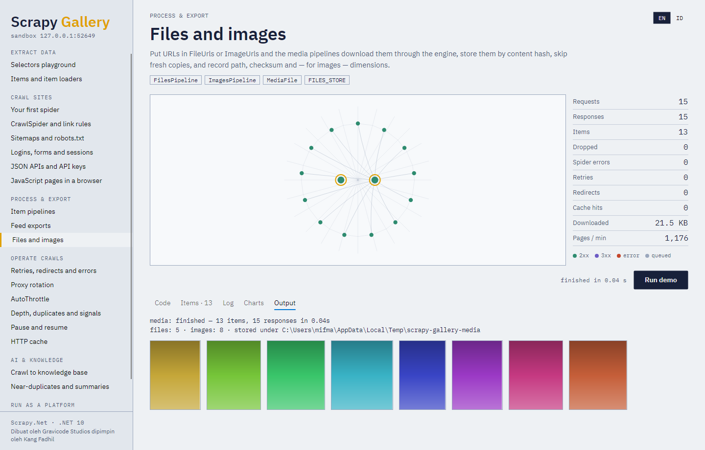

# 5. Item pipeline dan ekspor feed

## Item pipeline

Pipeline menerima setiap item, mengembalikannya (mungkin diubah) atau melempar `DropItemException`:

```csharp
public sealed class PricePipeline : ItemPipeline
{
    public override ValueTask<object> ProcessItemAsync(object item, Spider spider)
    {
        var product = (Product)item;
        if (product.Price <= 0) throw new DropItemException($"tidak ada harga untuk {product.Name}");
        return ValueTask.FromResult<object>(product with { Price = Math.Round(product.Price * 1.11m, 2) });
    }
}

settings.ItemPipelines.Add<PricePipeline>(300);          // angka lebih kecil berjalan lebih dulu
settings.ItemPipelines.Add(new LambdaPipeline(i => i), 400);
```

`OpenSpiderAsync` dan `CloseSpiderAsync` membuka dan menutup sumber daya (koneksi, file). Item yang
dibuang dicatat di level warning beserta alasannya dan dihitung dalam `item_dropped_count` serta
`item_dropped_reasons_count/...`.

### Pipeline bawaan

| Pipeline | Kegunaan |
|---|---|
| `CleaningPipeline` | Merapikan spasi, mendekode entitas, opsional membuang tag di setiap field string; transform per field dengan `.Field(name, fn)` |
| `ValidationPipeline` | `.Require(fields)`, `.Match(field, regex)`, `.Range(field, min, max)`, `.Rule(name, predicate)` |
| `DuplicatesPipeline(keyFields)` | Membuang item yang sudah terlihat (berdasarkan field kunci atau semua field), disimpan sebagai hash 128-bit |
| `AdoNetPipeline` | Insert batch ke database ADO.NET apa pun: SQL Server, PostgreSQL, MySQL, SQLite, Oracle |
| `HttpApiPipeline` | Mengirim item (atau batch) sebagai JSON ke endpoint REST atau webhook |
| `ElasticsearchPipeline` | Mengindeks lewat API `_bulk` (Elasticsearch atau OpenSearch), tanpa library klien |
| `FilesPipeline` | Mengunduh `file_urls`/`FileUrls`, menyimpan `full/<sha1>.<ext>`, mengisi `files`/`Files` |
| `ImagesPipeline` | Sama untuk `image_urls`/`ImageUrls`, memvalidasi dan mengukur gambar, thumbnail opsional |
| `RagIngestionPipeline` (paket AI) | Mengekstrak, memecah, meng-embed, dan mengindeks konten — lihat [AI dan RAG](10-ai-rag.md) |

Rangkaian yang umum:

```csharp
settings.ItemPipelines
    .Add(new CleaningPipeline().Field("Title", Transforms.Clean), 100)
    .Add(new ValidationPipeline().Require("Title", "Price").Range("Price", min: 0), 200)
    .Add(new DuplicatesPipeline("Url"), 300)
    .Add(new AdoNetPipeline(() => new NpgsqlConnection(connectionString), "products")
    {
        CreateTableSql = "CREATE TABLE IF NOT EXISTS products (title text, price numeric, url text primary key)",
        BatchSize = 500,
    }, 800);
```

MongoDB, S3, dan penyimpanan lain cukup beberapa baris `ItemPipeline` dengan klien resminya — kontraknya
sama.

### File dan gambar



```csharp
public sealed class Report
{
    public List<string> FileUrls { get; set; } = [];
    public List<MediaFile> Files { get; set; } = [];     // diisi pipeline: Url, Path, Checksum, Status
}

settings.Set(SettingKeys.FilesStore, "downloads");
settings.ItemPipelines.Add<FilesPipeline>(1);
```

Unduhan media melewati engine, sehingga mendapat header, cookie, proxy, dan throttling yang sama dengan
halaman. File yang lebih muda dari `FILES_EXPIRES` hari dipakai ulang (`uptodate`). `ImagesPipeline`
membaca dimensi gambar dari header PNG, JPEG, GIF, WebP, dan BMP tanpa mendekode piksel, membuang
gambar yang lebih kecil dari `IMAGES_MIN_WIDTH`/`IMAGES_MIN_HEIGHT`, dan membuat thumbnail
(`IMAGES_THUMBS`) lewat `IImageProcessor` yang Anda pasang dengan `IMAGES_PROCESSOR`.

## Ekspor feed

```csharp
settings.Feeds
    .Add("output/%(name)s.json", new FeedOptions { Overwrite = true, Indent = 2 })
    .Add("output/%(name)s.jsonl")
    .Add("output/%(name)s.csv", new FeedOptions { Fields = ["Title", "Price"] })
    .Add("output/%(name)s.xml.gz")                                        // gzip dari ekstensi
    .Add("output/batches/part-%(batch_id)03d.jsonl", new FeedOptions { BatchItemCount = 1000 })
    .Add("https://bucket.s3.amazonaws.com/feed.json?X-Amz-Signature=...", "json");   // PUT saat ditutup
```

| Opsi | Arti |
|---|---|
| `Format` | `json`, `jsonlines` (`jsonl`, `jl`), `csv`, `tsv`, `xml` — ditebak dari ekstensi bila null |
| `Overwrite` | Menimpa, bukan menambahkan (`-O` vs `-o`) |
| `Fields` | Kolom/field dan urutannya |
| `Indent` | JSON/XML yang rapi |
| `Encoding` | Encoding keluaran (default UTF-8) |
| `StoreEmpty` | Tetap menulis file meski tanpa item |
| `BatchItemCount` | File baru setiap N item (butuh `%(batch_id)d` atau `%(batch_time)s`) |
| `ItemTypes` / `ItemFilter` | Hanya mengekspor sebagian item |
| `Gzip` | Kompres (otomatis bila URI berakhiran `.gz`) |
| `CsvDelimiter`, `IncludeHeadersLine`, `XmlRootElement`, `XmlItemElement` | Detail format |

Placeholder URI: `%(name)s` (nama spider), `%(time)s` (waktu mulai), `%(batch_id)d`, `%(batch_id)05d`,
`%(batch_time)s`, dan argumen spider apa pun sebagai `%(argumen)s`. Tujuan: path file, `file://`,
`stdout:`, `memory:nama` (untuk test), dan `http(s)://` (diunggah dengan PUT saat feed ditutup — cocok
untuk URL presigned S3, GCS, Azure Blob, dan MinIO).

Exporter menulis JSON langsung dengan `Utf8JsonWriter`, sehingga ekspor tetap berjalan di aplikasi
trimmed/AOT dan aplikasi file-based .NET 10. Serializer field yang dideklarasikan pada field `Item`
diterapkan saat ekspor.

Memakai exporter secara langsung:

```csharp
using var stream = File.Create("items.csv");
var exporter = ItemExporter.Create("csv", stream, new FeedOptions());
exporter.StartExporting();
foreach (var item in items) exporter.ExportItem(item);
exporter.FinishExporting();
```
