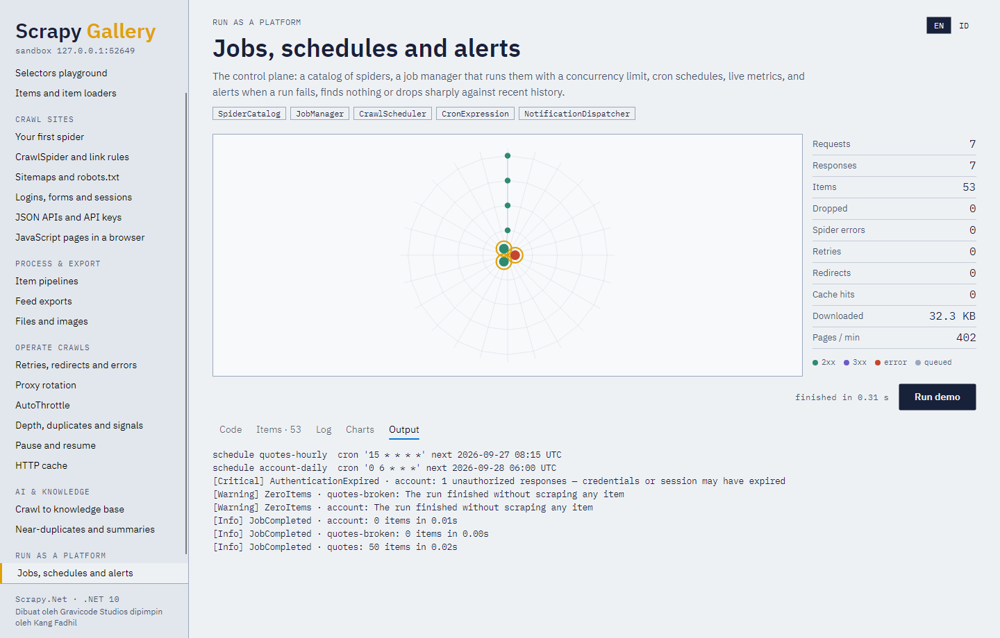
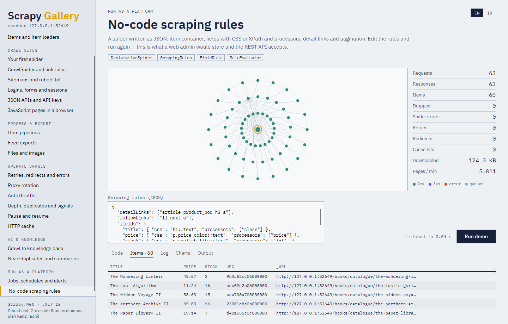

# 11. Platform dan server



Dalam platform crawler produksi, Scrapy.Net berperan sebagai **mesin crawling** dan sebuah control plane
mengelolanya: spider apa saja yang ada, kapan berjalan, bagaimana kondisinya, dan siapa yang diberi
tahu saat ada masalah. `Gravicode.ScrapyNet.Platform` adalah control plane itu;
`Gravicode.ScrapyNet.Server` menyediakan REST API di depannya.

```
             WEB ADMIN / REST API  (ScrapyNet.Server)
                         │
        ┌────────────────┴────────────────┐
   CrawlScheduler                     JobManager ── CrawlMonitor ── NotificationDispatcher
        │                                 │                              │
        └──────────────► mesin Scrapy.Net ◄──── SpiderCatalog     webhook · Slack · Teams · email
                                 │
                   pipeline → database · file · vector store
```

## Spider sebagai data



```csharp
var catalog = new SpiderCatalog("state/spiders.json");
catalog.Register<BooksSpider>();                           // spider berbasis kode

catalog.Create(new SpiderDefinition                        // spider deklaratif tanpa kode
{
    Id = "news",
    Name = "news",
    Target = new TargetConfig
    {
        StartUrls = ["https://news.example/"],
        MaxDepth = 3,
        IncludePatterns = ["/2026/"],
        ExcludePatterns = ["/tag/"],
    },
    Rules = new ScrapingRules
    {
        DetailLinks = ["article h2 a"],
        FollowLinks = ["a.next"],
        Fields = new()
        {
            ["title"] = new FieldRule { Css = "h1::text", Processors = ["clean"] },
            ["published"] = new FieldRule { Css = "time::attr(datetime)", Processors = ["date"] },
            ["body"] = new FieldRule { Css = "div.article-body ::text", Multiple = true },
        },
        RequiredFields = ["title"],
    },
    Settings = new() { ["DOWNLOAD_DELAY"] = 1, ["DOMAIN_HEADERS"] = new Dictionary<string, object?> { ["news.example"] = new Dictionary<string, object?> { ["X-Api-Key"] = "${secret:news-api}" } } },
});

catalog.Update("news", d => d with { Description = "Berita harian" });    // versi 2
catalog.Clone("news", "news-sports");
catalog.Rollback("news", 1);
catalog.Disable("news-sports");
```

Processor field: `strip`, `clean`, `lower`, `upper`, `remove_tags`, `price`, `int`, `decimal`, `date`,
`absolute_url`. `RuleEvaluator.Extract(rules, selector, url)` menampilkan pratinjau aturan terhadap
sebuah halaman — backend untuk UI pembuat selektor.

## Job

```csharp
await using var jobs = new JobManager(catalog, new JobManagerOptions
{
    MaxConcurrentJobs = 4,
    HistoryPath = "state/jobs.jsonl",
    DataDirectory = "data",                 // item → data/<spider>/<jobId>.jsonl
    Secrets = secrets,
});

var job = jobs.RunNow("news", arguments: new Dictionary<string, string> { ["section"] = "tech" });
jobs.Pause(job.Id); jobs.Resume(job.Id);
await jobs.StopAsync(job.Id);              // rapi
jobs.Cancel(job.Id);                       // seketika
var retry = jobs.Retry(job.Id);
var history = jobs.History("news");
```

Status: `Pending`, `Running`, `Paused`, `Completed`, `Failed`, `Stopped`, `Cancelled`.

## Jadwal

```csharp
await using var scheduler = new CrawlScheduler(jobs, "state/schedules.json");
scheduler.Add(new ScheduleEntry { Id = "news-hourly", SpiderId = "news", Cron = Schedules.Hourly(minute: 5) });
scheduler.Add(new ScheduleEntry { Id = "prices", SpiderId = "prices", Cron = "0 6 * * MON-FRI", TimeZone = "Asia/Jakarta" });
scheduler.Start();
```

`CronExpression` mendukung rentang, daftar, langkah, nama, dan `@hourly`/`@daily`/`@weekly`/`@monthly`/
`@yearly`. `Schedules.EveryMinutes(n)`, `Hourly`, `Daily`, `Weekly`, `Monthly` membuat jadwal umum.
Run yang tumpang tindih untuk spider yang sama dilewati kecuali `AllowOverlap` diset.

## Secret

```csharp
var secrets = SecretStore.Open(Environment.GetEnvironmentVariable("SCRAPYNET_MASTER_KEY")!, "state/secrets.json");
secrets.SetLogin("shop-login", "crawler@example.com", "p@ss");
secrets.Set("news-api", SecretKind.ApiKey, "k-123");
// Setting mereferensikannya sebagai ${secret:news-api} atau ${secret:shop-login:password}
```

AES-256-GCM dengan kunci PBKDF2-SHA256 (210.000 iterasi); nama secret menjadi data terautentikasi,
sehingga ciphertext tidak bisa ditukar antar nama. Placeholder diselesaikan tepat sebelum job berjalan,
sehingga plaintext tidak pernah masuk ke definisi atau riwayat job.

## Monitoring dan peringatan

```csharp
using var monitor = new CrawlMonitor(jobs);
var dashboard = monitor.Snapshot();       // job berjalan beserta metrik langsung, jumlah selesai/gagal,
                                          // item 24 jam terakhir, laju request, tingkat error, status per spider

new NotificationDispatcher(jobs)
    .Route(new SlackNotifier(slackWebhookUrl), AlertSeverity.Warning)
    .Route(new TeamsNotifier(teamsWebhookUrl), AlertSeverity.Critical)
    .Route(new EmailNotifier("smtp.example.com", 587, "bot@example.com", ["ops@example.com"], credentials), AlertSeverity.Critical)
    .Route(new WebhookNotifier("https://hooks.example.com/crawls"), AlertSeverity.Info, AlertType.JobCompleted);
```

| Peringatan | Muncul saat |
|---|---|
| `JobCompleted` | Job selesai (info) |
| `JobFailed` | Job gagal |
| `SpiderErrors` | Callback melempar exception atau ada error di log |
| `TargetInaccessible` | Request terkirim tetapi tidak ada yang kembali |
| `ZeroItems` | Run tidak menghasilkan item apa pun |
| `AbnormalItemDecrease` | Jumlah item di bawah separuh median run sukses terakhir |
| `AuthenticationExpired` | Respons 401/403 atau redirect ke halaman login |

`RawContentExtension` mengarsipkan setiap halaman mentah beserta metadatanya (`RAW_CONTENT_DIR`) sehingga
data bisa diekstrak ulang tanpa crawl ulang; `RawContentArchive` membacanya kembali.

## REST API

```csharp
var builder = WebApplication.CreateBuilder(args);
builder.Services.AddScrapyNetPlatform(o =>
{
    o.DataDirectory = "platform-data";
    o.AddApiKey(builder.Configuration["Keys:Admin"]!, "admin", PlatformRole.Admin)
     .AddApiKey(builder.Configuration["Keys:Dashboard"]!, "dashboard", PlatformRole.Viewer);
});
var app = builder.Build();
app.MapScrapyNetApi("/api");
app.Run();
```

| Endpoint | Peran |
|---|---|
| `GET /api/health` | siapa saja |
| `GET /api/spiders`, `/api/spiders/{id}`, `/api/spiders/{id}/versions` | Viewer |
| `POST /api/spiders`, `PUT /api/spiders/{id}`, `DELETE /api/spiders/{id}`, `POST .../clone`, `POST .../rollback/{v}` | Admin |
| `POST /api/spiders/{id}/run`, `.../enable`, `.../disable` | Operator |
| `POST /api/preview` — uji aturan terhadap sebuah URL | Operator |
| `GET /api/jobs`, `/api/jobs/running`, `/api/jobs/{id}`, `/api/jobs/{id}/items`, `/api/jobs/{id}/metrics` | Viewer |
| `POST /api/jobs/{id}/stop|pause|resume|cancel|retry` | Operator |
| `GET /api/schedules`; `POST /api/schedules`, `DELETE`, `enable`, `disable` | Viewer / Operator |
| `GET /api/dashboard`, `/api/alerts` | Viewer |
| `POST /api/webhooks` | Admin |

Klien mengautentikasi dengan `X-Api-Key: <key>` atau `Authorization: Bearer <key>`. Lihat
`samples/ScrapyNet.ServerHost` untuk host yang siap dijalankan.
